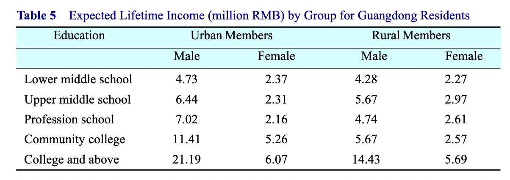

投资子女教育大概是很多父母最大方的开支之一了，不过不论国内国外，现在都出现了军备竞赛式投资，国内是明着暗着的辅导班，国外则是各种爬藤指南，孩子们则学习了大量高考或工作后就完全不碰的应试技巧与知识。这伙完成了自我阶级越迁或固化的父母深感知识眼界的重要性，对子女教育的规划的精细程度与效果都堪比计划经济时代，连孩子的出生日期都要精打细算，甚至会去相信量子速读这种玄学都算不上的骗局。只能说骗子骗傻子也算是一种人类文明优秀的匹配机制，就这骗子还总是不够用。

其实这个问题可以算账的，在能力足够的情况下，投多少钱要有多少收益，否则都吃不饱饭何谈其他诉求。但不管是小升初还是中考高考考研，这个收益当时是看不见的，得等孩子工作了拿工资单才能知道。不过确实有人对学历做过研究，下图我们可以看出确实学历越高工资越高，但这倒不一定说明教育提高了工作能力，更可能是现在找工作需要学历来设置门槛。

这里我得说清楚一件事，那就是职业学位指的是MD、JD、MBA这类读完本科才能读的学位，国内对应的是专业硕士与专业博士，是强就业导向的学位，主要原因是医生、律师等职业需要大量的实习来累积经验，而通常意义上的博士不要求太多实战经验。这一点可以类比普通高中与职业高中，一个培养普通人，一个培养工程师或工人。国内舆论长期被普通高中的高考参与者把控，所以会对职业高中有莫名其妙的优越感，但职业教育的最终待遇并不比普通教育差多少，也是不可忽视的一部分。但这里我还是只谈普通教育，因为职业教育我也确实查不到太多资料。

在学历等价未来高收入的预期条件下，所有理性父母都会投资升学。根据美国社安局网站[数据](https://www.ssa.gov/policy/docs/research-summaries/education-earnings.html)，男性本科学位要比高中学位终生多赚90万美元而女性则多63万美元，而拥有研究生学位则比高中学位多赚150万（男性）与110万（女性）美元。这里我们可以估计出一个研究生学位大概能帮一个男性一辈子多赚60万美元或一个女性一辈子多赚47万美元。或者我们可以说，如果你在一个研究生学位上投资超过40万美元就属于拆东墙补西墙。不过，相信绝大多数想拿研究生学位的连400美元都出不起，回报率一比一千，还是很值的。

其实这也可以拿来估计学区房的溢价，国内一线城市学区房溢价大概是30%，也就是500万的非学区房大概等于650万学区房，这里的差额150万。理论上来说，如果一个孩子升学与否造成的终生收入差距低于150万，那么高溢价就毫无意义。这里我查到了广东的[数据](https://ideas.repec.org/a/fec/journl/v12y2017i1p113-131.html)，如下图所示，可以看出城市居民是否上大学终生收入对男性差1475万，而对女性差376万。不得不说国内学区房的溢价还算是在合理范围内的，只是这个性别差异也太大了。

但学区房终归只是一个升学的既不必要也不充分条件，而且也算是教育资源不公平的体现。如何能让教育资源公平呢？我觉得确实应该用投资视角去考虑，也就是用回报来定价。你培养出一个废物，那么你收废物学费就不合理；同样培养出一个人才，就应该享受人才的回报而不是收一笔学费就完了。

事实上，学费这个东西非常多余，无法公平展示教育的成果，不如完全取消掉，改成用学生工作收入的1%，直接交给国家统筹，一直收到你退休。从上面的终身收入来看，一个有大学学位人的终身学费应该在6-20万人民币之间，这个价其实还高于当前国家对大学生的平均投入（大概2万人民币），大概跟当前国家补助加学生自掏的学费在一个量级上。当前国家人均工资性收入在两万元人民币，也就是说可以每年拿到2800亿的教育投资收益，高等教育在学人数四千万，北京市公立教育学费平均大概5000元，也就是说高等教育学费总额大概2000亿，也就是这多出来的2800亿拿来免除学费绰绰有余，还能补贴给初等教育800亿。这多出来的钱也好处理，用来打击教育资源分配不均造成的学区房与超级高校的乱象，通过投资非重点高中与普通高校，逐渐抹平学校间资源差异。要知道国家现在每年的教育预算大概是五万亿人民币，而国家投给高等教育占教育总投资的四分之一，大概1.3万亿，多出800亿来说不算小数目，足够办不少事了。

这个策略核心是避开让公众反感的增税，学习万恶的互联网免费策略，先把人套进来再说。某秃头海豹动不动就号召加税搞社会化抚养属于让既得利益者割肉，完全拿捏不到这些中产，想推政策就得既往不咎还得先给甜头。大学生大都处于人生最穷的阶段，你给他们免费上大学然后要个1%属于温水煮青蛙，而且实打实说，现在让工作的人拿出1%收入也不至于要死要活，反正都是看到手工资。而且技术上现在也比较成熟，招工时反正也要看学历，直接扣了转国库就行，最多加个学信网验证也并不困难。学校也应该跟自己的学生共同承担教育风险，想收个学费就白嫖校友捐赠，门也没有。

早就有研究发现毕业学校对长期职业发展表现影响有限了，而真正影响职业发展的是高考成绩。成绩高不论去了什么学校，长期看表现都差不多。也就是说，学校的牌子是虚的，自己的能力是实的，如果依赖牌子找工作只能保你个底线，真正决定长期收入的是个人能力。这也是高考结束后各地高校到处抢高分考生的原因，是学校要依赖学生出名而不是反过来，反过来就成拖后腿了。既然要依赖学生，不如就依赖到底，直接入股自己的学生，免费教他们，然后让他们用自己收入回馈母校，这比现在搞得乌烟瘴气的校友会要强得多。

不过，这并不是说取消掉入学考试，免费高等教育依然要有门槛，但这个门槛就是过线就免费而已。至于学生去哪里，国家可以通过资源倾斜扶持普通高校，现在的资源都给了双一流也不是好现象。真要重点投资给中科院就可以了，集中力量办大事，高校让民间资本去折腾就行，现在来看高校可以搞点突破，但搞不了面突破。类似Deepmind这种公司才是以后出重大成果的地方，他们搞一个Alphafold2用了30个人的团队烧了5年的钱，人均工资开到30万美元才能做出遥遥领先第二名的结果，高校靠微创新根本不可能养得起这种烧钱规模的团队，要么会因为中途没成果解散，要么会因为钱不够吸引不到人才。投资精英高校基本就是投资教授们在论文上内卷，还不如多投资些高校拉平学校差异，这对地方发展会是长期正面效应。

执行上没必要一刀切，先试点。可以让学生自己选一次付清或长期1%，不过这里一次付清就不能算国家补贴了，这可能会导致学费翻倍。不过对比美国高等教育的学费，翻倍也够不到零头，家里没钱无脑选免费就可以了，取消掉那些国家级各类评优奖学金，反正现在民间的奖学金也从来不缺，国家级奖学金改成荣誉就可以了。不过，各学校可以依据自己财力免除掉自己比较穷的毕业生的供养，但交给国库做二次分配的钱一分也不能少。每年要出一份自己毕业生的供养报告，这跟捐助不一样，反映的是所有毕业生的供养水平分布，这样家长选学校也有个参考，毕竟每个高校都能出一两个富豪，他们的案例参考价值不大。政策推行期间可以让已经毕业的人自愿选择是否加入这个计划，自己定义一个不超过1%的收入来反馈，但新毕业的选了免费教育的就严格执行。当然，这说的都是公立学校，私立学校都是随意的，但我想最先想响应这个政策的反而是比较新的私立学校，因为这可以给潜在学生家长一个量化的预期而不是盲目的投资。

不过，肯定有人会说那赚的少交的少对交的多的也不公平。这世界上就没有完全公平的事，赚的少的原因可能就是没教好，赚的多可能就是能力强。但1%比宗教十一税可以降了一个数量级啊，与其让这伙心灵手巧但空虚的中产卷王做题家去供养仁波切，不如来投资教育。试想，如果这部分资金能缓解学区房的高溢价，1%的工资是不是有点过于便宜了；如果去任何一本大学都能有类似的教育资源，是不是就不用去搭建鄙视链了；如果普惠的高等教育真的能跟家长一起去负责学生的未来终身收入，那么还有什么好焦虑的？眼光长远点，不然也逃不了被骗子当傻子坑的结局。

另外也有人会说要是出国留学怎么办？不办啊，征收成本太高，享受国内免费大学教育然后跑路海外的事就算在交学费的今天也很常见。确实这会损失一部分收入，但上面已经算过了，国内现在工作的就能养得起。所有接受国内免费高等教育的学生回国发展，从国内赚的钱再交1%就行了。没必要对留学生斤斤计较，他们中很多人本来也不会给国内任何贡献，锱铢必较更大可能培养一个敌人。这里也没什么公平不公平的，钻漏洞的同胞在在任何国家表现都是精致利己的，这种人自有其局限性来收拾。

其实，这种可以用投资眼光来做的事还有很多，例如社保、养老金等，不过这些就没必要给甜头了，毕竟大家已经习惯了。但有些事还是有必要的，例如现在的人口问题，要知道养孩子确实也算份全职工作，只要他们能通过考试证明自己是合格的父母，应该给那些有未成年子女的父母发工资。那些不知道怎么做父母的人的子女就需要国家的社会化抚养来兜底了，不然也是家暴受害者或社会不稳定因素。至于不想做父母的，只是少了一份工资来源，并不影响自己当前收入。

其实这样做的道理很简单，就是风险共担，投资不能只吃肉让别人挨打国家兜底，把收入跟风险挂钩才能激发积极性，这个原理很多现代企业都用烂了，就是员工持股。只有一项事业跟从事事业人的未来挂钩，这个人才会认真对待，教育尤其如此。

