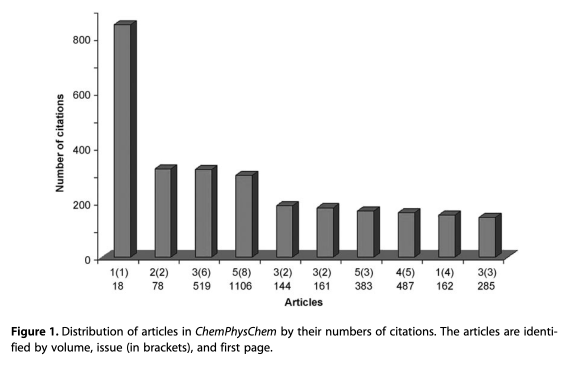
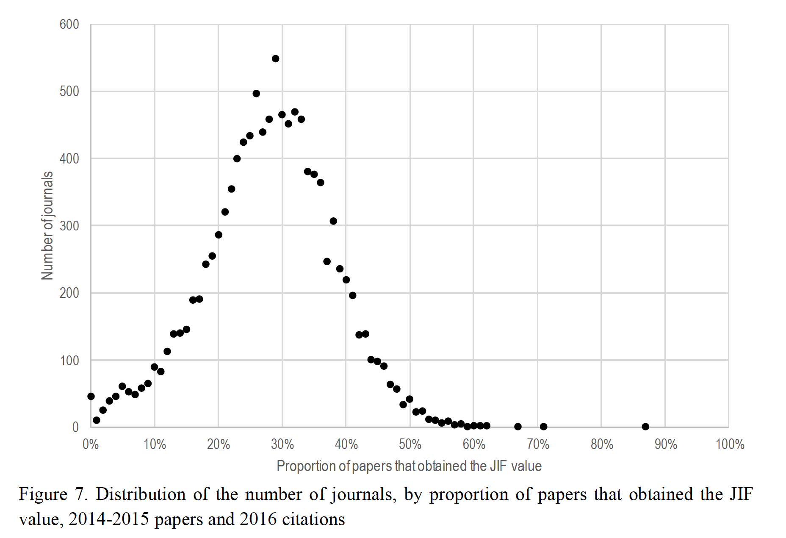
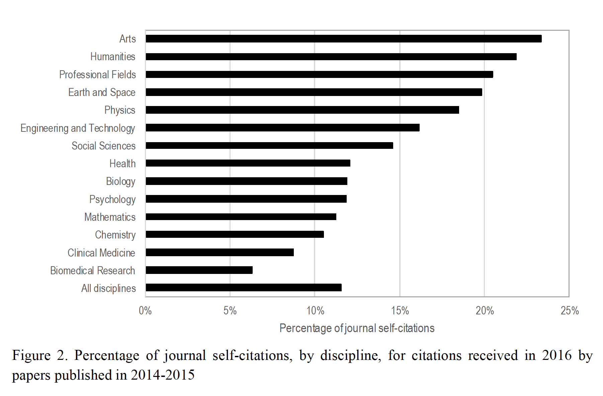
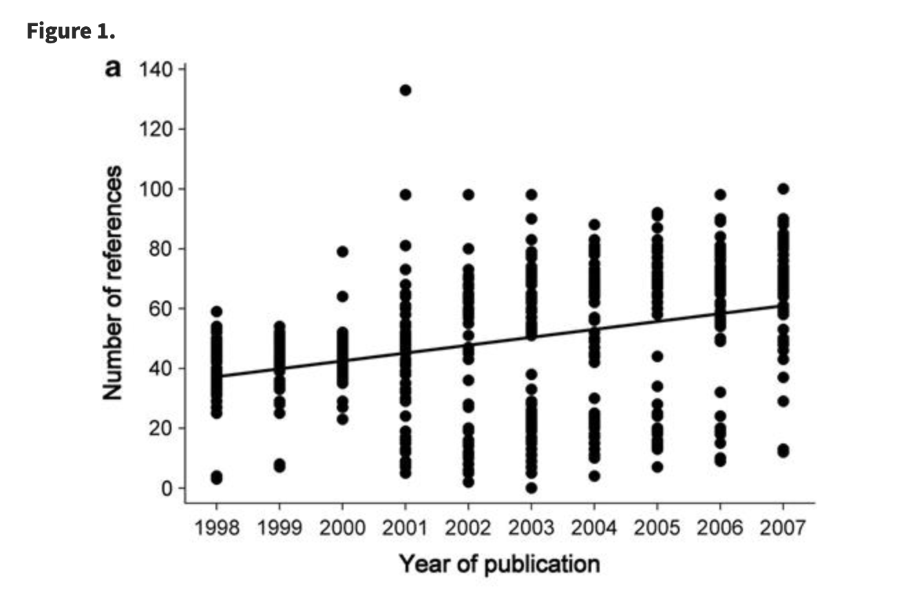

每到六月底学术界就跟过年差不多，主要原因是前一年的期刊影响因子会公布。不出意外又是个皆大欢喜，大部分期刊影响因子都有提高。这里我们就来梳理下影响因子的相关数据与议题。

根据 Eugene Garfield 在JAMA上的[自述](https://jamanetwork.com/journals/jama/article-abstract/202114)，影响因子是他1955年在 *science* 上提出的一个想法，这个利用引用来评价的思路发展到1961年出版了第一版 *Science Citation Index*。之后他与Irving H. Sher在美国科学情报研究所（ISI）联合创造出了期刊影响因子。ISI后来被汤森路透收购而期刊影响因子报告则作为报告出售，但到了2016年ISI这块业务又打包卖给了Onex公司与霸菱亚洲投资基金（基金经理就是网传在上海买不到菜的徐新，不过今年又被欧洲一个私募给收购了），成立了独立的Clarivate，也就是科睿唯安公司。现在我们看到的期刊影响因子理论上都应该是科睿唯安公司发布的。

但其实影响因子的计算方式其实并不困难，就是某一期刊的2021年影响因子就等于其于2019年2020年两年发表文章在2021年的引用数除以这两年的发文量（研究性文章，要有同行评议），打比方A期刊2019年与2020年两年总发文量100，这100篇在2021年被引用了500次，那么其影响因子就是5。因为算法早就公开了，所以就算JCR还没发布，很多期刊自己也能在2021年年底后算出自己2021年的影响因子。这里主要依赖的是 WoS 跟 Scopus 这两个付费的引文数据库，不过因为开放科学的推动，现在主流期刊基本都会开放引文的交叉查询，所以估算出的影响因子通常差不多。这里要补充的信息是影响因子计算涉及的学术期刊并不包括所有学术期刊，今年期刊影响因子涉及了大概有两万多份期刊，其中收录于SCIE的大概九千多份，Scopus 收录了4.3万份期刊不过活跃的只有2.7万份，而[Scimago](https://www.scimagojr.com/journalrank.php)也收录了大概2.7万份期刊，历史悠久的化学文摘数据库则收录了大概八千多份期刊，总体而言当前学术期刊总量应该在三万份这个量级上，影响因子计算可能会有疏漏，不过考虑到绝大多数学术论文引用量奇低，所以这个疏漏影响不大。

影响因子是用来评价期刊的，但更多人熟悉的是拿期刊来评价人，例如某某在影响因子高达某某的期刊上发表了论文。其实这属于本末倒置，就好比通过学历来评价学生一样。刚毕业学生如果来自名校自然好找工作，但毕业十几二十年还在到处宣传自己母校的大概率都是水平达不到母校平均水平而只能依赖母校牌子来忽悠人，社会招聘跟应届生招聘最大区别就是更多通过实际工作业绩来招人而不是通过学校牌子来保障一个最低水平。

同理，刚进入学术界的人大家都不了解，通过影响因子来评价算是一种期刊信用透支。但运行时间比较长的课题组在某个领域已经形成声誉了，此时研究工作发在任何地方都影响不大，因为不论发到哪里都会有人关注。2009年一项[研究](https://www.phil-fak.uni-duesseldorf.de/fileadmin/Redaktion/Institute/Informationswissenschaft/stock/fulltext_The_Inflation_of_Impact_Factors.pdf)考察了期刊 *ChemPhysChem* 上面的论文引用状况（见下图），结果发现期刊里论文的引用状况并非高斯分布而更像幂律分布，少数高引用论文主导了期刊的影响因子。

而2016年出版的[书](https://link.springer.com/chapter/10.1007/978-3-030-02511-3_1)则发现大概只有30%的论文引用情况能达到或超过其所在发表期刊的影响因子（见下图）。因此，通过影响因子评价期刊文章水平对于大多数文章而言都是高估了。相应的，本来引用很高的文章也会更多宣传自己单独的引用率，因为影响因子反而是低估了文章影响力。如果一个人长期津津乐道于自己的高分文章，大概率是引用不大行拖期刊后腿的。很不幸，这部分人占了大多数，没有实现影响因子自由。

很多研究人员简单通过影响因子去评价自己不熟悉的工作或人。不过这也无可厚非，毕竟学术界大了，总要有些量化指标方便外行来比较。网上关于影响因子讨论最多的可能就是各路研究生跟期刊编辑编委，但长期吃科研饭的人关注度就一般了，因为行业内虽然还是看重影响因子，但由于这些年新期刊出来搅局外带预印本服务器的流行，他们更关注自己工作的引用数与影响力，这些对于申请基金有更直接的帮助。当找教职的人还在宣传自己论文所在期刊影响力时，另一些人可能更多去宣传自己的封面文章或高引论文了，不过真正做评价的人还会关注候选人不同于其独立前课题组传统研究方向的工作，这些更说明研究潜力，否则其实就招了个大课题组的远程分支实验室，当然有时候这对学院/研究所团队建设也挺重要的。

影响因子自从出现后就没少出现争议。除了前面拿影响因子评价人的误用外，另一点就在于影响因子分子分母的计算上，因为分母只算研究性论文而分子可以算所有引用，所以很多期刊就会搞一些编辑导读、观点评述、读者来信啥的栏目，这些栏目大都没有同行评议不会被算到分母里，但他们也会去引用学术论文或高亮某些研究，这样就可以给引用量注水了。另一个就是综述性期刊，因为综述相比具体研究更容易获得大量引用，所以很多期刊会选择在创刊时先找资深研究人员写综述，这样很快就会形成一个比较高的起点。

还一个就是文章半衰期，影响因子的计算算得是发表后两年内的引用量，确实很多学科发展日新月异，超过两年的文章可能连读的价值都没了，但更多学科特别是基础学科发展没那么快，引用的大头在两年之后，根据自然指数网站的[研究](https://www.natureindex.com/news-blog/whats-wrong-with-the-jif-in-five-graphs)，生物医药类文章引用量两年达到高峰，但社会科学的文章在发表10年内的年均引用量几乎不变。如果拿影响因子去评价不同学科是肯定有问题的，拿着高影响因子学科的文章跑到低影响因子学科里去做所谓“跨学科”研究或经费申请的降维打击也不太公平，当然这种输出性内卷有时也会给传统学科带来危机感，从而推动学科发展。

影响因子计算上，自引率也是一个争议点。2007年一项[研究](https://edoc.hu-berlin.de/bitstream/handle/18452/9945/213HWb3G2qJzw.pdf)表明，期刊引用存在马太效应，好的期刊更愿意引用自己的论文而其他期刊也会引用好的期刊，这导致期刊会自发形成高影响因子的权威性。2016年所有期刊[自引率](https://link.springer.com/chapter/10.1007/978-3-030-02511-3_1)大概在12%左右（见下图），存在明显学科差异。2020年一项[研究](https://onlinelibrary.wiley.com/doi/full/10.1002/leap.1348)考察了 1975-2017 年期刊的自引情况，发现其实所有期刊自引率其实是下降的，1975年大概20%，到了2017年不到15%，高影响力期刊确实比低影响力期刊更多引用自己期刊内容，但更多是最近两年的工作，属于相对良性的。不过，自引率高也可能是期刊编辑操纵的结果，JCR就曾经移除过一些通过提高自引率提高影响因子的期刊，但这种操纵影响因子的小把戏还是很常见。例如，很多期刊拒稿的理由就是引用文献里没有本期刊的论文，说明内容不属于期刊的研究领域。但反过来说，如果投某期刊就要引用该期刊内容，客观上也就推高了这个期刊引用率，这种现象属于灰色地带，很难判断动机。

那么开放获取呢？最近几年各大出版集团可算找到了敛财利器，新期刊层出不穷，逐渐形成期刊矩阵来抢夺优质稿源，其中一个旗号就是开放获取的引用率高。不过，早在2008年的一次随机对照[实验](https://www.bmj.com/content/337/bmj.a568)中就发现，生理学科的期刊开放获取并不能有效提高发表后一年的引用率。这篇文章本身属于开放评论的，通过文末评论我们可以得知，作者后续又追踪了几年，结果依然是不支持提高引用率的结论，甚至2011年的一项[研究](https://pubmed.ncbi.nlm.nih.gov/21450907/)发现药学、跨学科研究、人类学等其他学科也有类似现象。也就是说，如果认为开放获取运动提高了引用率是不恰当的，开放获取更多是提供了出版业的利润率。其实我认为开放获取最大的意义在于知情权，公众出钱的研究理应让公众看到结果，付费开放获取与研究机构订阅期刊只是朝三暮四的收费方式差异，只是商业模式的不同存在套利空间罢了。我更看好的是类似 [*Journal of Machine Learning Research* ](https://www.jmlr.org/)这样追求全流程免费且开源的在线出版模式或预印本服务器这种自存档手段，但全志愿者运行效率肯定高不到哪去就是了。总之，开放获取是不能去背影响因子提高的锅的，这属于两个议题。

那么影响因子的增长情况如何呢？1975年的JCR里，影响因子最高的是*Journal of Experimental Medicine*，影响因子为11.874，但2021年影响因子最高的期刊*CA-A CANCER JOURNAL FOR CLINICIANS* 影响因子到了286.13。影响因子超过10的期刊在1997年只有49份，而到了2007年就有105份，到今天有660份。我查了一下过去五年的11198份期刊的影响因子，平均值从2017年的2.359增长到了2021年的3.814，就连中位数都从2017年的1.633涨到了2021年的2.551。所以期刊引用大涨是毋庸置疑的，但原因却是不唯一的。

首先我们知道全球科研活动在过去几十年是增长的，中国科研从业人员直线甚至曲线上升的，人多了研究成果多了，发表自然就多了。学术期刊每篇论文引用的文献数都是两位数起步的，这样发表越多，引用就越多。因为引用明显集中到少数论文里而大多数论文发表就没人看，因此一定会推高头部期刊影响因子的。另一个原因则在于引文工具现代化与DOI流行，现在添加参考文献非常简单，点几下鼠标就能加进去，换格式也很方便，[研究](https://academic.oup.com/bioscience/article/60/6/455/242286)显示引用文献数量是直线上升的（见下图）。不过这个很难验证是不是软件的锅，毕竟你问我为啥引用四五十篇，我更可能说是读得多而不是加得方便。科研活动增多与引用增多还算得上正面原因，不过影响因子也是可以操纵的。

影响因子工程学大概是所有期刊编辑都听过的术语，最近几年很多期刊转成了专业编辑而非学术兼职运营，这样很多手段就出现了，例如前面说的大量发表影响因子里不算引用项目的文章。不过还有些手段不怎么上台面，那就是强迫引用，一项[研究](https://journals.plos.org/plosone/article?id=10.1371/journal.pone.0187394)指出，20%的受访学者认为他们受过各种类型的强迫引用，包括但不限于审稿人要求引用相关研究、编辑要求加入对本期刊引用，而这种情况在高影响力期刊里更常见，属于心照不宣的交换。其实有些引用是相关的，但另外一些引用纯粹就是无效引用，例如2017年 *Land Degradation & Development* 主编就在其负责的其他期刊的82份稿件里额外要求了622个引用，把影响因子从3.089炒到了8.145。吃相如此难看的案例毕竟少数，但对于发文量不大且编辑话语权比较强的期刊，这种小动作很容易把影响因子炒起来。

总之，影响因子的通引膨胀现象是值得关注的，倒不是说影响因子本身有多少意义，而更多是对科研评价体系的思考。但我更希望研究者能回归研究本身，提炼有意义的科学问题而不是去刻意追求评价指标，成败帝王事，真假后人传。

其实我本来是打算写一篇过去五年影响因子分析的，但写个前言到这里发现搞成了影响因子的文献综述。不过我还是把自己的分析结果简单说一下吧，毕竟数据源属于灰色：

- 研究范围是有2017年到2021年五年影响因子的11198份期刊
- 过去五年引用量与影响因子的描述性统计量都在提升
- 线性回归发现 4319 份期刊影响因子是线性显著升高的，只有50份期刊线性显著下降的
- 提高的期刊平均影响因子小于所有期刊的平均影响因子，说明是普遍性提高
- 2021年影响因子排名前1000的期刊有522份期刊在过去5年线性升高
- 有些期刊虽然也在升高，但不是线性的（此处有大坑，线性回归检验不出来）

另外有些问题可以探索，但我觉得读者可以自己动手尝试下（~~总不能说实话是我懒吧~~）：

- 开放获取期刊的引用是不是更高（验证前面文献结果）
- 学科间是否存在引用外溢现象，也就是卷到其他学科
- 那些学科在走下坡路
- 设计一个更合理的统计量来描述期刊/个人学术水平
- 非学术论文类引用概括，例如新闻、软件、博客、推特、会议等

此外，能看到这的麻烦来填个表吧，到现在还是个位数留言。

<https://wj.qq.com/s2/10408005/9374/>
