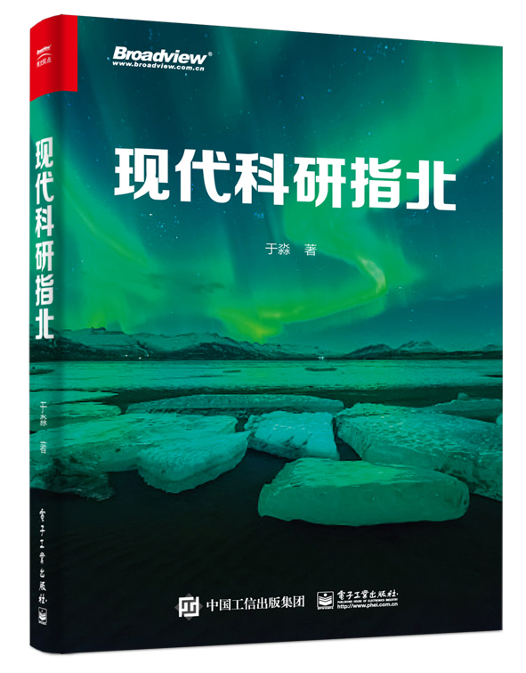

《现代科研指北》已经上市，指北奖学金计划细则也公布在了开源版的issue[里](https://github.com/yufree/sciguide/issues/13)了。老实说，如果没有指北奖学金，我可能并没有多少动力去推广这本网上有免费版的书，现在就当众筹做实验了，心理平衡多了。

目前京东淘宝当当搜书名都有货了，但官方店还没货，预计下周才有货开始推广活动。原价是66元，如果肯等一等，那么近期开学季在京东、当当都有满减活动，我还有个专属折扣链接可以申请（下周到货了后我能拿到，会更新在这里），折后单买还不够免运费的，要凑单。有工资的朋友对科研感兴趣欢迎支持，也欢迎家里有搞科研的学生的买来当开学礼物。还在花家长钱的学生党们不建议购买，本书开源版本这个页面右上方就有入口，欢迎先上车后补票。希望你买书是为了自己，要是为了支持我就算了，我不重要，这书赚的钱最后都会送到奖学金奖池里，我要饭都是坑大户的。

这本书能出版首先要感谢电子工业出版社的付睿老师与徐艳老师。特别是付睿老师，因为一开始我只是想放到网上分享，能有出版社编辑来谈出版事宜属于直勾钓鱼了。不过，我确实很好奇出书的流程，后面长达一年半的来回修改与三审三校最先满足的是我的好奇心。在这个过程中，我从两位专业编辑身上学到了解到很多，特别是了解到了我真实的语文水平。我也特别感谢两位老师能协助我通过一轮轮审核，出版一本有观点的书并不容易。

其次，目前封底推荐语分别从学术界、出版界、学生、非学生四个类别进行了推荐。我很感激为我写封底推荐语的江老师、涂老师还有两位通过问卷吐槽的网友。其实问卷目前收集到两位数了，后面的几份推荐语挺好的，不过很遗憾因为时间原因没法放到封底了。也有通过问卷留下批评意见的朋友并留了联系方式，很遗憾，这种吐槽就算我发给编辑也不会被选的。另外，这个[吐槽收集计划](https://wj.qq.com/s2/10408005/9374/)会一直开通，年底或某个时间节点我会集中公布统计数据并回复其中的吐槽。

再次，这是出版社设计的封面，我认为非常切合主题。毕竟指北最远也就指到北极，而现代的北极正在经历冰川消融，暗示了当前科研中存在的问题。

最后，我自己很不要脸的在全网搜了一下这本书，然后很意外发现很多网友的吐槽。下面是收录了《指北》的文章、推荐文章或列表，所谓物以类聚，又所谓拔出萝卜带出泥，跟《指北》放在一起的应该质量也有保证。只是我没想到读《指北》的人背景这么复杂，如果你们看到了希望你们能把这种收集推荐习惯坚持下去，于己于人都是一笔财富。这里我做个汇总：

- [关于科研的种种-从理论到实践](https://zhuanlan.zhihu.com/p/513765150)

- [读《现代科研指北》|| 或谈谈硕博生活要则](https://www.jianshu.com/p/8ea4bd7577c2)

- [现代科研指北笔记（一）](https://blog.csdn.net/mojujiang/article/details/110819846)

- [关于如何科研的相关资料](https://zxl19.github.io/academic-guide/)

- [读《指北》：多重假设检验记录与思考](https://shixiangwang.github.io/blog/multiple-stats-testing-and-thinking/)

- [关于如何科研的相关资料](https://zxl19.github.io/academic-guide/)

- [中文总榜 > 资料类 > R](https://github.com/Tirklee/GitHub-Chinese-Top-Charts/blob/4ddb578f1696f4160a2ec52cfe0a8081dcdc1f93/content/charts/overall/knowledge/R.md)

- [好物分享17-科研巡礼01-科研第零课：关于科研入坑的学习资源](https://cloud.tencent.com/developer/article/1920316)

- [一些优秀的网络内容资源](https://idushu.com/%E4%B8%80%E4%BA%9B%E4%BC%98%E7%A7%80%E7%9A%84%E7%BD%91%E7%BB%9C%E5%86%85%E5%AE%B9%E8%B5%84%E6%BA%90/)

- [随缘分享第 4 期](https://xuanwo.io/2021/01-share-with-luck-4th/)

- [互联网游荡杂志（第三期）](https://chowdera.com/2021/12/202112171111551186.html)

- [电子书](https://github.com/dingeral/net_note/blob/86e75b2f4a444413313ec01888ef0059d3215b72/docs/%E8%BD%A6%E5%BA%93/%E7%94%B5%E5%AD%90%E4%B9%A6.md)

- [02-北外图书馆好看吗？](https://github.com/mugpeng/second_brain/blob/48e29037131a8f5fb81116f6d73c5b39434922c3/docs/02-%E5%8C%97%E5%A4%96%E5%9B%BE%E4%B9%A6%E9%A6%86%E5%A5%BD%E7%9C%8B%E5%90%97%EF%BC%9F.md)

- [科研工具及技能表推荐](https://github.com/MLNBA-Lab/DataCollection2Public/blob/1ece83ca3d1e2009cc5c8c25b7cdf8100fae47bf/%E7%A7%91%E7%A0%94%E6%96%B9%E6%B3%95%E5%8F%8A%E5%B7%A5%E5%85%B7/%E7%A7%91%E7%A0%94%E5%B7%A5%E5%85%B7%E5%8F%8A%E6%8A%80%E8%83%BD%E8%A1%A8%E6%8E%A8%E8%8D%90.md)

- [学习笔记——机器学习与经济学](https://github.com/jmxsy2016/Data-Science-and-Economics/blob/aeebd1f13c4881fdd1d30222f9d1848c0c684a93/README.md)

- [计算机电子书 2021 Git 仓库备份](https://github.com/apachecn/it-ebooks-archive/blob/66a1d479215c0e325d5b86175996a7677d4ff19c/docs/it-ebooks-2021.md)

