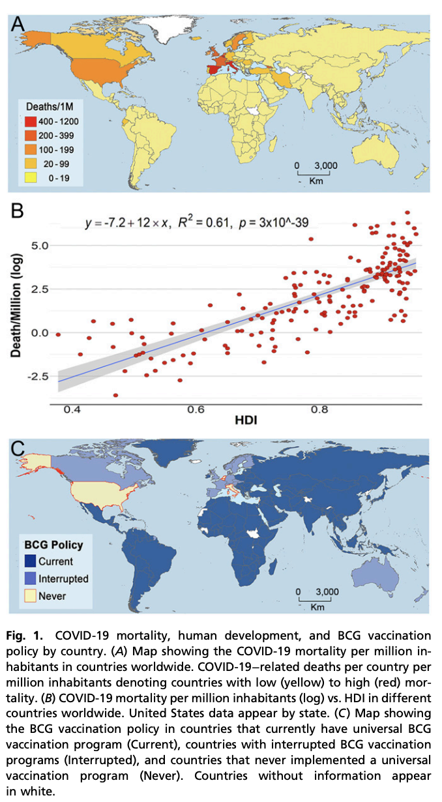
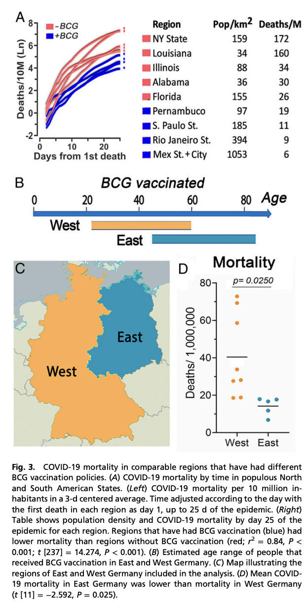

2018年我刚到美国，本打算第二天入职上班，结果做体检时被告知TB测试阳性，需要抽血二次检验才能入职，然后我就知道了一个美国特色的现象：美国人从未接种过结核疫苗。因为这个原因，我白白损失了两周工资，当时我查了些资料，发现国内强制接种的卡介苗其实有效性存疑，而美国本土已经通过地理优势与隔离消灭了肺结核的本土流行，所以不用打卡介苗，当时就当成个入职小插曲很快就忘记了。

时间来到2022年，现在我在美国接种了四剂新冠疫苗，两针常规接种，一针加强，一针omicron二价加强。其中，第二针常规接种我发烧一天，最近一针omicron二价加强发烧两天，后者跟我中了omicron的同事症状完全一致，因此我有动机怀疑这二价加强是不是给我单纯打了活病毒。当然这是玩笑话，但比这更离谱的是国内自21年年底打完加强针后就好像忘了疫苗这事一样。如果我还没老糊涂，20年新冠刚开始时一堆专家说只要疫苗打够了疫情就会过去，后来疫苗打够了，但好像防疫还停留在20年的封锁水平。直到最近，突然性放开才又想起来疫苗这茬，这时候一查数据，发现最该打疫苗的老年人很多一针都没打，白白浪费了继续封锁期间带来的疫苗免疫黄金期。

亡羊补牢也不晚，眼下我写文章这会北京还有一些省会城市正在经历高峰，坦白说这些地方医疗资源相对充足。等后面春运开始，大规模阳性蔓延到医疗资源本来就不足的中小城市与乡镇，那才是疫情的真正开始。现在估计大概还有两三周的延迟，如果这个阶段能让老年人抓紧接种疫苗，也许还不算晚。

不过很明显国内存在很强的反疫苗势力，这主要归功于宣传部门的投机心理，认为只要防下去，新冠总有一天会跟SARS一样神奇消失，然后马照跑舞照跳，一切回归正常。但SARS的消失才是奇迹，人类历史上除了天花被疫苗消灭过以外病毒突然出现又消失的案例非常罕见，更常见的是流感这种一年来一次的状态。因此，以后大概率要年年打疫苗。

这里有个常见误区，认为疫苗可以防感染。但哪怕你只有高中生物的知识量也知道疫苗的起作用原理就决定了不会防感染。疫苗起效方式就是遇到病毒入侵用先前疫苗诱导产生的抗体识别后中和排出，要是足够多足够快病毒的量累积不到出现症状就消灭完了，表现像是防传染其实就是速率差，本来就不是说打了疫苗就金光护体。而且高中生物也明确说过特异性免疫与非特异性免疫的问题，疫苗会同时激发特异性免疫与非特异性免疫，日常干活的是非特异性免疫，那个识别到异物就会包裹排出或直接干掉被感染细胞，感染初期也是非特异性免疫在干活。特异性免疫一般要过个十天半个月才出现，效率高但慢，此时会生成特异性抗体。特异性抗体在第一轮感染结束后绝大多数会被清除，但会留一些记忆细胞，这些记忆细胞可以帮助下次感染时直接进入特异性免疫阶段，用极高效率清除病毒，这也是疫苗起效的原理。这里面记忆性B细胞在体内存续时间会比较长而记忆性T细胞寿命相对短一些。

那么出现免疫逃逸的变种是不是疫苗就没用了？这是另一个误区。免疫逃逸会使得感染时出来干活的特异性抗体效率变低，这个是没问题的，但这不代表先前疫苗引发的免疫记忆完全失效，就算重新生成特异性抗体，有类似记忆细胞还是会大概率提高这个特异性免疫的生成效率，完全没感染过需要十天半个月，感染过类似的可能两三天就生成了。要知道免疫风暴这种见到感染细胞就搞死的模式就是非特异性免疫阶段的主要特征，如果你提早启动特异性免疫，哪怕早几天，可能就不会出现免疫风暴这种免疫系统集体抽风的状态，而重症或者说基础病并发症很大程度都是免疫风暴打破体内内环境平衡导致的。所以能打加强针就去打，让你的免疫系统记性好一点没问题。老年人之所以更需要，很大程度是因为他们记忆细胞本来记性就不好，打疫苗或加强针是为了让你的免疫系统更有效工作，这里没有完美解决方案，只有特异性免疫产生的速率跟非特异性免疫瞎胡闹的速率产生的速率差，越快产生特异性免疫，就越不可能出现重症。此外，疫苗变异后毒性并不在讨论之列，在体内免疫系统特别是非特异性免疫系统面前，不论啥病毒都是异物。

不过，这里会涉及另一个误区，那就是认为打了疫苗照样阳性所以没用。这跟认为打疫苗防感染是一个问题，我们去打疫苗，不是为了避免阳性而是为了正常生活。假设一个人体内病毒含量很高，但他毫无感觉与症状，那么我们是不是还要管这个称作“病”。历史上确实有“伤寒玛丽”这样的案例，她能传染别人但自己确实就是没事，类似的故事可以说被新冠及其变种演绎了无数遍。一个文明的社会不应该限制正常个体的自由行动，但如果其无法被识别或识别成本过高，那么最好的应对方案就是打疫苗。打完疫苗的效果其实就是创造了更多的无症状无传染性的感染者，打不过就加入。面对当前这个变种，大规模检测筛查不经济也不具备可持续性，本就是疫苗出来前的过渡方案，最终我们的选择只有疫苗或被感染这两条路。

其实，疫苗防重症这件事并不是只有新冠疫苗才有，有效率50%的猜硬币式流感疫苗也能防止流感导致的重症。现在很多人都不把流感当回事了，但一百年前那场大流行其实到现在还一年来一次，你不能因为太熟悉就不当回事，前几年有人写到流感带走老丈人的文章可是着实带火了保险行业，只要你稍微多想一点就要明白我们现在能生存在地球上本就是个逆天改命的操作。另外，我查文献反而发现了另一个问题的答案，那就是为啥美国新冠死人这么多？

当前的解释都是从管理角度来的，会去说美国检测力量大，数据透明，但我看到PNAS上一篇[论文](https://www.pnas.org/doi/abs/10.1073/pnas.2008410117)却从免疫角度给出了一个答案，各位看下这张图：

从新冠死亡数据来看，凡是强制免疫过卡介苗的国家新冠死亡率都会低于没有免疫过的国家。而如开头所说，美国这块新大陆靠着隔离的优势实现了肺结核的清零，然而新冠来了后却成了重灾区。类似的故事五百年前也上演过，那时候新大陆原住民因为隔离没有被传染病影响快乐生活，然而欧洲人带来了天花，直接团灭了原住民。而跟美国不打卡介苗情况类似的另一个国家是意大利，也是新冠刚开始时的重灾区。所谓前人种树后人乘凉，很可能其他国家只是因为肺结核没清零反而对新冠重症有了免疫力。即使从地区层面看也差不多，下图就表示了东德西德因为卡介苗疫苗的施打率不同出现的死亡率差异。数据很漂亮，但能不能我们不要用死人这种实验来说明一些高中生就知道的简单的道理？

基于此，其实如果国内能抓住时间差，在未来半个月内对老年人进行强制免疫，那么国内放开期间的额外死亡人数很可能能压缩进一百万之内。如果接着宣传疫苗无用或疫苗有害，那么是不是该判个反人类罪？如果你说我一个人都不想死，接着封锁，那后面直接间接要死的人可能就不止一百万了，说到底我们的很多政策其实都是在逆自然规律与社会规律的，短期可能还行，但长期看一定是一个回归正常的过程，这个过程会死人。就像美国这块新大陆上相隔五百年的故事一样，隔离只会弱化你应对未来的风险。

总之，就一句话：

去！打！疫！苗！
