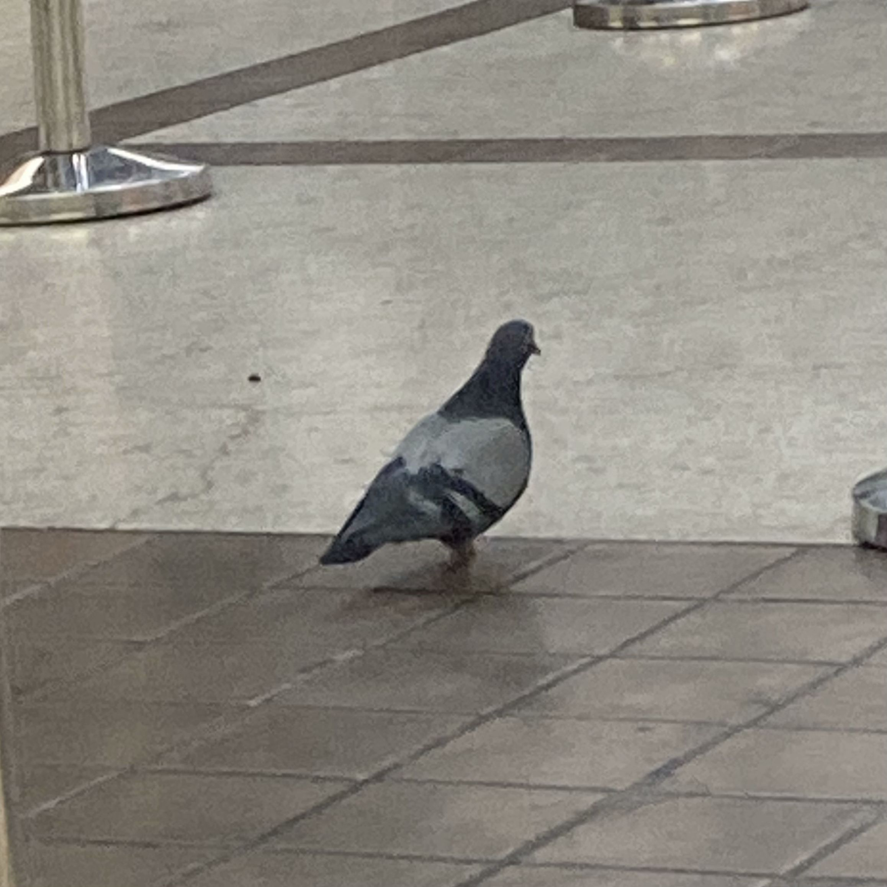

上周末又回纽约，先去找馆子打牙祭，然后又去唐人街地下室理发，之后又买各种中式调料，天色一暗就去福建味中味拎了两笼包子，在港务局车站吃包子等大巴，期间还差点错认了一个研究生同学。

要说这港务局车站地下一层，常年都会有鸽子偶然飞进去，也不怕人，就是乱飞。我喂鸽子那是有前科的，之前就在中央公园附近撒过薯片，只不过这次的包子是我惦记一个多月的美食，所以舍不得。但这次的鸽子比之前尤其特殊，因为这是只无趾鸽（见下图）。

其实我刚到纽约的时候，就注意到鸽子普遍少一个脚趾，每次观察到都觉得应该研究下，但因为这事实在琐碎，后面竟一次也没查资料。在纽约疫情最严重的时候，我天天蜗居在公寓，每天能见到的活物就是在窗台闲逛的鸽子。那时候比起脚趾，更明显的感受是鸽子比之前外面见到的普遍瘦了，想来是纽约人那时都不出门，把这些当惯了城市宠物的鸽子给饿坏了。

这次我算是记住了，回来就马上查资料。很明显，我不是第一个观察到这个现象的，甚至这个现象最早都不出现在纽约。Biological Conservation 杂志上有人[研究](https://www.sciencedirect.com/science/article/abs/pii/S0006320719306901)过巴黎的鸽子，他们开始以为是某种城市污染物或传染病，研究半天发现相关性最强的是人的居住密度，但鸽子趾又不是药，再仔细研究又发现理发店附近的瘸腿鸽子特别多，至此他们就形成了一个假设。

鸽子在城市里可以说几乎没有天敌，同时，鸽子的饮食结构其实也非常依赖城市人类。也就是说，鸽子断趾可以说是被城市圈养的代价，当它们不断接触人类会获得食物，但却可能被人类头发缠住脚趾。人类可以将缠绕的头发解开，但这对鸽子难度就非常高了，不但高而且鸟类的脚趾表面粗糙如果缠上头发自然脱落也困难。因此，缠绕的头发就会越来越紧，最后脚趾得不到血液循环会坏死脱落。这种事属于带反馈机制的，一个脚趾断掉平衡就受损，从此就很难在树枝上抓握栖息。而越是在地面行走就越容易再被缠上，到最后就是我见到的那种所有脚趾都失去的状态，只能依赖人类的喂食而生存。

与人类共处对人类而言都不是简单的事，更不用说动物了。鸽子可以说是温顺和平的代表，但在城市住久了也会变成瘸子甚至无法再次栖息在树上。城市对于生态系统而言就是个怪物，里面符合经济规律的东西大都不符合生态规律。如果没有城市这种聚居形态，就无法养活一个职业理发师，同时，城市生活的压力也可能造成脱发，这些东西在人类看来都是自然而然无须多言的，但对于鸽子就不一样了。

人类自己也是被城市圈养的动物，为了委身城市，人类自然也会像鸽子一样丢掉自己的“脚趾”，放弃“树枝”，学会“踩高跷式”的行走方式。然后这些无趾之徒就会美化无趾化过程，把这当作文明进步的一部分，用价值判断来合理化自己的适应，总结为一部部“智慧”的结晶。

嘿！文明真是个神奇的东西。
