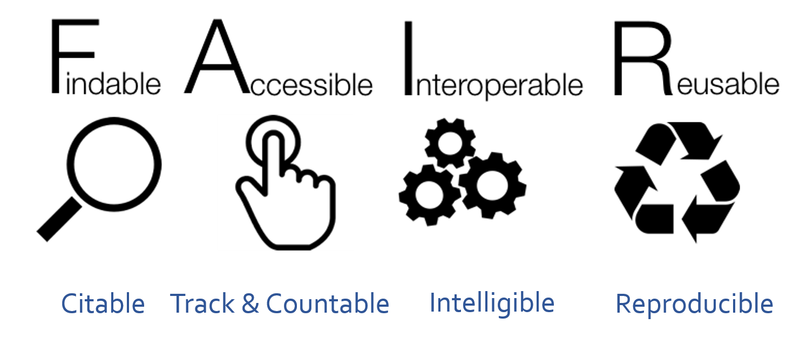
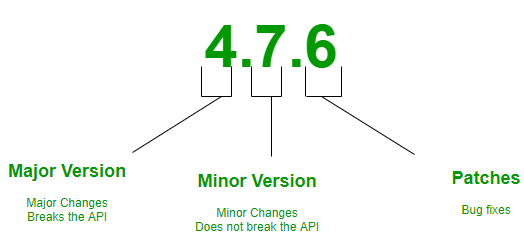

开放科学这个主题我在《现代科研指北》里做过总结，最近研究所例行培训里又推送了个一天的开放科学课程，但我那天已经报名了另外一个课，所以就去查了下课程页面。不出所料，这个课程类似《指北》，也是个完全的开源[项目](https://carpentries-incubator.github.io/fair-bio-practice/index.html)，课件网上都准备好了，我们所的内部培训其实就是请个人过来在固定时间固定地点集中学一下，很多时候课程场景下的学习还是有优势的。

说起来这个培训模式在北美研究机构挺常见的。科研中很多技术、技能或趋势都是快速出现迭代的，指望读学位时那点童子功或员工自学经常是不赶趟或有代差，因此研究机构会从外部请一些公司过来做短期培训，如果是仪器公司这种他们主动掏钱，如果是技能这类研究机构出钱。通常这种培训在大学里是系里面博士或博后办公室组织，在研究机构就是科研服务平台负责组织，有很多学术会议最开始几天也有类似培训，一般不超过三天，我们这边要是全都参与那正事都干不了了，我个人是凭兴趣大概一两个月参与一次。按我观察，每次参会人数20-50人，参与人大都是工作不饱和的新员工与中层管理人员，大多数都是专职科学家与课题组长，因为主题比较新更适合科学家跟课题组长拿来作为要饭噱头。但最该来开拓眼界的研究生与博后反而不多，大概是他们工作过于饱和。其实我现在这个职位要求就有给研究机构提供主题培训这一条，不过好像是系里专门的几个组去做。

国内这块对于在职科研人员的培训基本就看缘分了，基本靠自学跟开会，好一点的系也会时不时组织报告，但同样存在学生的培训机会少于课题组长的问题。这事完全看研究机构决策者的眼光了，盯着眼前那一点还是面向未来？浪费时间还是投资新机遇？这里没有绝对好坏之分，把握度很重要，很多系里的报告属于学术报告而不是培训报告，这种只有小同行才会有收获，培训报告这种大同行收益的东西还是要有。

因为我参与不了这个培训，所以就快速过了下这个课程的内容，这里分享一下笔记。

这个课程对开放科学的定义是透明且自由获取知识数据的行为实践，这是很宽泛的定义了。三个要点是

- 互联网连接交流
- 研究全流程透明
- 公众可获取

其组成部分为

- 开放获取
- 开放数据
- 开放软件
- 开放笔记
- 开放审稿
- 公民科学
- 科学设计网络
- 开放教育资源

需要进行开放科学的原因是

- 钱：付款者可看到成果
- 可重复性：提高研究结果有效性
- 个人分享意愿

开放科学的主要障碍是

- 敏感数据
- 知识产权
- 额外精力时间
- 假消息/不专业

开放科学要遵守FAIR原则

<a href="https://commons.wikimedia.org/wiki/File:FAIR_data_principles.jpg">SangyaPundir</a>, <a href="https://creativecommons.org/licenses/by-sa/4.0">CC BY-SA 4.0</a>, via Wikimedia Commons

其中要点包括

- 永久标签（PID）可引用
- 可下载 可计数
- 纯文本 方便读取处理
- 元数据 数据说明 明白易懂
- 许可证 可重现
- FAIR不代表开放 但开放一般遵守FAIR原则

下面是与开放科学相关的议题：

- 知识产权：新的对公众不开放的，出版与会议发表会阻止拿到专利，数据是关于事实的，无法产生版权，软件无法保护版权但代码有版权

- 元数据：描述数据的数据，包括管理信息，引用信息，结构信息，用户视角，方面其他人用

- 个人网络标志：ORCID

- 开放电子实验笔记：所有实验流程都要保留电子版

- 文件命名：有版本号，可以有时间，有文件扩展名，短名字，不要有空格或特殊字符，同类的放到同一个文件夹下

- 数据管理计划（DMP）：对实验数据生成处理存储全生命周期进行分阶段管理，保证数据可以被重复使用与二次挖掘

- 项目文件夹管理

        文件夹结构：

        - 一个项目一个文件夹
        - doc 子文件夹用来放文档
                - 版本控制 CHANGELOG.txt 说明改变原因
        - data 子文件夹用来放原始数据
        - result 子文件夹用来放处理过数据
        - src 子文件夹放代码
        - bin 子文件夹放编译好的程序
        - 文件命名体现内容或功能
        - 不要用连续数字命名，因为一定会变
        - 三次备份，一个离线备份
        - 准备好模版
        - 版本号 SemVer CalVer
        

        
这个课程项目本身在 GitHub 上[托管](https://github.com/carpentries-incubator/fair-bio-practice)，大概是12个学时的内容，思考题、版权、引用这些信息网站上很全，里面大部分内容《指北》里都有，不过也有些我之前没考虑到的东西，后面我也会整合补充到《指北》里。这里建议对开放科学感兴趣的朋友可以抽个半天左右的时间看看，毕竟我这边更新会很慢。
        