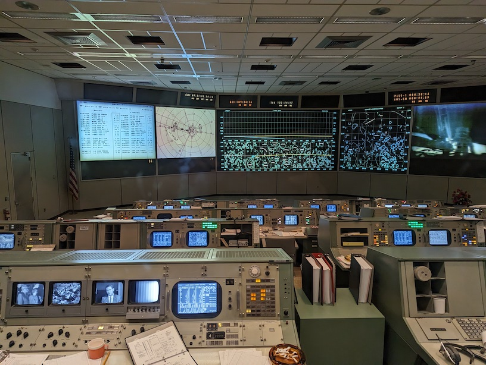
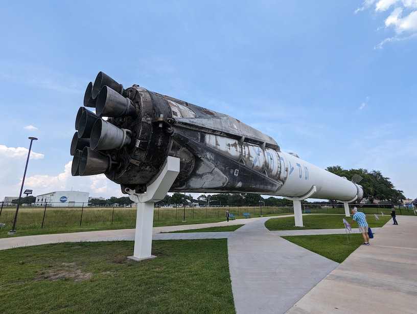
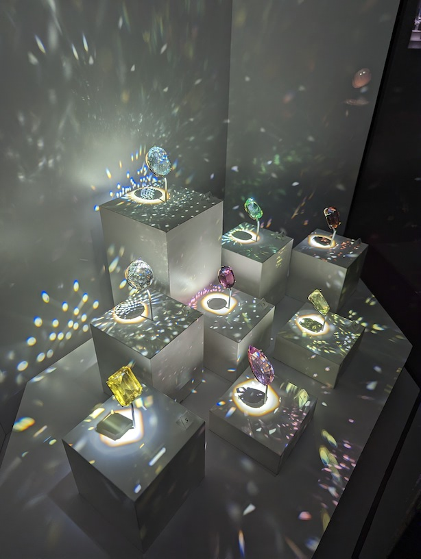

今年ASMS在德州休斯顿举办，其实如果没有疫情，20年的ASMS本应该在这办，只是因为疫情转到了线上。今年基本恢复了疫情前的所有活动，甚至大陆地区也有人过来开会了，当然人数确实也不多，很多是学生来了老师没来，估计签证或护照方面还是有限制。ASMS在欧洲有个对等的IMSC年会，不过这些年欧洲走下坡路趋势很明显，很多仪器厂的重要产品都会选ASMS来亮相，另一个分析化学领域的匹斯堡会议（PittCon）主题更通用一些，也是每年一次。在美国大城市转圈开的ASMS跟PittCon会议注册费都相对比较低，会员或提前注册的价格都在400刀以内，而且有买几赠一的规则，这主要是因为这些会会被仪器公司赞助，赞助多了就会把每个人注册费降下来，其余化学领域的会大都500刀往上了，毕竟这些会都是实际由会议公司运营，他们不会做赔钱买卖。

这次我走前特别查了下天气，因为我日常自带头顶祥云效果，到哪都下雨，结果查了下说休斯敦一年三百多天大晴天就放心不带伞了。然后，来休斯敦后下了五天雨，还有几天是暴雨，手机上都收到强暴雨警报那种。不过倒是把康州这边的雾霾天给躲过去了，好像是加拿大那边山火吹过来的，属于后院起火了。我以后考虑把所有的旅游用具都升级为防水款，省的这祥云效果再出啥幺蛾子。

说到会议，美国这边会议经济还是值得称道的。目前会议都有专门的手机应用，可以拿来标注感兴趣的议程或联系人，比起传统发一本厚厚的会议手册要容易得多。而且应用里也保留了疫情期间的一些功能，例如可以直接在报告下面提问，这对社恐型参会人员比较友好，当然报告人可能在结束会议后才看到，但可以跟聊天室一样继续问答。另一个有用的功能就是专为就业设置的就业中心，可以直接开会期间提交自己简历或招聘启事，也备有可预约的会议室让双方可直接约时间当场面试，跳过行政筛选步骤直接跟懂业务需求的人聊，这种方式比海投要直接高效多了，我还看到大都会博物馆在招懂质谱的人。而ASMS的会议设计也非常高效，早上是仪器商赞助的早餐，然后8:30到10:30是上午口头报告，10:30到2:30是海报报告，2:30-4:30是下午口头报告，然后会有一个45分钟全体报告，颁个奖啥的，之后会发点酒水零食，接着就是一个多小时的主题工作坊（workshop），可以理解为讨论组或圆桌会议，几个嘉宾做10分钟的分享，之后就是互相问答，这里你能看到不同观点的人差点打起来的场景。然后是一小时的晚饭时间，每天都会有个大赞助商来发饭，但去晚了就没了。晚8点到11点是在酒店举行的招待会，不同仪器厂商会包下不同大小房间展示自己的新产品，发放免费酒水、礼品还有各种游戏，是提供社交的场合，这次还去玩了会厂商版的德州扑克，还有吃豆人游戏机，最搞笑的是很多公司都发德州牛仔帽，他们很默契用了不同颜色，PEAK这个做氮气发生器的公司用了绿色，然后我就看到会场里一堆顶着绿帽子的男男女女，这要是放到国内怕是一定会上热搜的。当然如果你早来两天，会议最开始其实是各种付费短期课程，用来教一些比较前沿的技术，这个是任何人都可以申请的，但批不批不一定，我印象中如果你来教课，注册费是免得。当然你也可以来当志愿者，几天下来除了要做的引导工作会给几百刀补助，适合学生申请，如果有不错成果也可以申请奖学金。会议最后一天会有一个大的付费招待会，这次是包了一个博物馆，边游览变吃自助。总之，如果你全身心开会，早上7点到晚11点可以全部排满，除了机票跟住宿，别的都可以找赞助商解决，但这比上班还累。

另外就是美国这些大城市市区的会议中心与周围酒店也都是靠会议来养活，基本一周一个会，大规模的包全场，小规模包酒店，根本不愁没人住这些四星五星一天几百刀的酒店，而且酒店跟会议中心甚至会用廊道直接打通，方便学术交流后的社交，周边餐饮也不愁没客人。这是个很典型的发达服务业主导的经济模式，其实顺道也会提振当地旅游业，例如有年我去奥兰多开会，参会人员就可以买个40刀的票，然后有天晚上环球影城就被这个会给包下来了，所有参会人员凭借胸牌可以进去随便玩，类似今年包博物馆这样，也是创收手段。一年52周，每周承接一个几千人的会议，这边会议刚结束，那边就开始重新布置会场迎接下一个会议，带来的外来净消费应该在上千万美元规模，可以提供几百相关服务业稳定工作岗位，更不用说会议作为信息交流中心对当地产业或学术的促进作用了。

同时，这也是很多会议强制要恢复线下的原因，没有人的流动，经济就没法带活产业，全线上固然不妨碍交流，但没法给实体经济注资，政府或企业投给研究的钱有一部分是希望通过这种方式花出去的。全线上虚拟交流可以省钱，但没必要，制造业转移后服务业也还是要承接劳动力密集型的社会需求，大环境下失业人口的社会风险要远高于省钱的优势，现代经济的核心在于价值交换，价值交换是一个网络，你可以用虚拟技术缩短了网络间的距离，但会敲掉价值交换链条上吃饭的个体，这个净效应我评价不出来。不过，互联网时代之前我们买东西会经过层层代理商加价，现在网购确实价格低了，很多实体店也消失了，地方就业会受影响，对应利润大头就跑到科技公司或大城市那边了，如果我们能不断创造新职业来吸收转业人群倒也罢了，否则这个所谓的效率提高代价就是贫富差距与社会稳定性。说白了就是经济链条上中间商是吃差价的，但中间商也有百万漕工衣食要养，技术进步可以敲掉中间商，但要解决技术性失业人员的再就业或社会福利保障，否则一定会招致保守派势力的强烈抵制与反弹。没错，我这里就是在暗示ChatGPT可能带来的冲击。

这次我是坐美航的飞机，他们在很卖力推销信用卡，一个没有开卡消费单刷就给7万里程的年费卡，我很好奇这又是啥套路。另外很意外发现美航上没有座位后面的娱乐平板了。取而代之是一个带二维码的宣传材料，扫描后可以连上局域网，付费的话可以联互联网，不付费可以看机内娱乐系统的电影电视剧啥的。就是把原来的娱乐平板换成乘客自己的平板或手机了，而且后座上也有个支架可以放平板或手机。原来是发耳机的，这些年无线耳机基本普及了，所以连耳机都没了，很多人就是带个耳机看剧，当然现在后座上多了个USB充电口。我不清楚这是不是疫情后的改变，但去年应该还没有，这个趋势下我倒真得考虑要不要再买个平板当旅行用品了。开会期间也发布了苹果的头显，不知道会不会以后飞机上的娱乐系统就全改局域网模式，你有啥设备就能体验啥娱乐这样。我在上面看了《蚁人3》，相当俗套的爆米花超英电影，感觉好莱坞已经被各种禁忌给限制死了，题材剧情也就那样了，整部电影就是给征服者康这个反派做个铺垫，靠粉丝大概也能这样拍下去。回程我就去补《生活大爆炸》了，你要问为啥不在飞机上看文献写论文，我只能说我还没到把自己搞成学术机器的地步，我这种懒散风格的出成果也不差这几个小时。我敬重那些全身心科研不浪费任何时间的朋友，很多老师忙得真就差这几个小时，而我也有过忘了做报告现场跟别人调顺序然后利用别人讲的二十分钟整理出幻灯片的经历，但没必要一直高压自己，这样很容易陷入空虚与紧张的循环中，还是平常心就好。另外机场看到超声洗眼镜的机器，5刀一次，亚马逊上7号电池驱动的超声清洗机不到10刀，还是资本会做生意。

作为旅游目的地，休斯敦最著名的应该就是航天中心。NASA有两个比较有名的景点，一个是佛罗里达的发射中心，另一个就是休斯敦的指挥中心。这个指挥中心离市区大概半个多小时车程，早10点开门，会有个特别的15刀项目可以游览一个1小时长度的重建的69年登月场景，体会下当时媒体视角。指挥中心有一块可以触摸的月岩，还有一块不可触摸的火星陨石，里面展区涵盖了航天飞机、国际空间站、水星计划、双子座计划、阿波罗计划、火星计划等的内容，甚至最新的阿耳忒弥斯计划，但只有几块展板，印象比较深的就是说这次新登月计划要在月球南极登陆，准备长期开发。

航天中心外面有一架波音747，上面放了个航天飞机的等比例模型，展示了当年航天飞机可以在波音747上起飞的状态，另外还放了个猎鹰9号火箭，就是马斯克17年反复发射的那一枚。其实冷战之后，NASA这边经费就一直在砍，不过商业航天与中国航天的崛起启动了新一轮的太空开发。当前天上运行的空间站就两个，一个是非常大的国际空间站，一个是中国的天宫号空间站，国际空间站的修建是完全没有涉及中国，看起来阵营已经分出来了。我在这边买了个都市传说中的纪念品，就是那种反重力可在太空写字的圆珠笔，其实网上也有卖的，当然铅笔那段子也就听一下，太空环境特别害怕尘埃特别是导电尘埃，食物都搞成膏状或液体，不过我猜现在都触屏化了吧，可能语音或键盘甚至脑机头盔输入做记录更简单。

会议结束的自助餐是在休斯敦的自然科学博物馆，本来我预期不高，对里面的恐龙啥的也不感兴趣，不过二楼的矿石宝石展还是很惊艳的，相比钻石这种碳蛋子，还是有很多精美的矿石。这里的宝石展室设计非常有意思，灯光全关了，就靠展台内部灯来展示，特别能展示宝石的闪亮。另外还有几个展厅里所有的东西都可以触摸，还有特别关注德州的生态环境的展厅，这个博物馆应该是属于自然历史或者说博物学类型，跟纯自然科学搭边的就只有一个傅科摆了。真要是博物馆向旅游可以考虑Citypass通票，不过我这次就去了这两个，另有个艺术向的还有个葬礼博物馆没来得及看，下次再说吧。

另外就是去靶场体验了射击。之前我所在的州靶场都比较偏远，但休斯敦一搜一大把，这边靶场需要先签个免责协议，然后租枪买子弹就可以了。我遇到的那个店员得知我没开过枪后说要55刀上个课，不过他随后又说你要是就来体验下我把我手枪借你，你就买个子弹跟靶纸就行了，还说其实可以从沃尔玛买子弹，属实良心商家了。然后，他就在枪店一角教了大概10分钟就带进靶场了，教的内容大概就是枪口永远不要对人，也不能在靶场外装子弹，然后就是如何握枪，到里面教了如何装弹上膛就完了。体验完后感觉就是枪声很大，我戴了小耳塞也觉得大，最好用耳麦，但后座力比预想小，必须要双手持枪口才不会飘，而且那把手枪好像没有保险，顶上枪匣后拉下枪栓松开子弹就上膛了，然后扣动扳机就会射出子弹了，我感觉单眼瞄准还是挺准的。对普通人而言心理障碍是打靶最大的障碍，我第一次装子弹手是抖的，但开了第一枪后就好很多了。德州靶场是可以体验半自动步枪的，但太贵了，枪跟子弹都贵，我这种新手直接不考虑。现实中如果出现枪击场景，普通人（包括我）很容易被枪声吓懵，弹壳也会乱飞，禁枪控枪对普通人更安全。另外就是不要在打靶当天去机场，身上有硝烟反应，可能被安检扣下来小黑屋伺候，这也是店员告诉我的，当然德州机场的警察也都是持枪的。

打车的时候跟这边一个红脖老铁司机聊了下，这位司机是坚定的川普支持者，但他强调他只支持川普当总统，但不喜欢作为商人的川普，也不支持佛州州长。谈到枪他的说法是枪是工具，坏的是人，人要犯坏用刀也能杀人，汽车也能撞人，总不能禁了刀跟车吧，至于说半自动步枪，那玩意太贵，用那个杀人的都是脑子有问题有预谋的，不用半自动步枪也会用其他方式报复社会。其实这就是支持拥枪人的主要论调，话都是实话，但这就是典型的定性定量混杂，用定性而不是定量观点来论述，枪、刀、车、辣椒水等都是能杀人的，但容易程度不一样。确实社会上有坏人，但坏人有枪是不是更容易作恶，不过对这点的反驳在于说要让所有人都持枪，这样坏人就不敢开枪了。这也是诡辩，因为所有人持枪既不安全也不现实，经济条件也不允许，说这话都是站着说话不腰疼的，也就是本来就有枪的，到头来大家都得搞军备竞赛了，单纯就是提高了军火商收入，还有就是肯定有些人根本就开不了枪，没练习过心态不过关，开枪大概率会导致误伤。不过这种话赞成拥枪的觉得无所谓，他们会说这是你自己的问题，保护不了自己不能怨别人，到这里也就死循环了。另外，这个司机的其他行为也很川普，他支持俄罗斯，说乌克兰已经打到俄罗斯境内了，美国不应该在海外花钱管闲事，也认同很多事源头就是美国，特别是民主党政府埋的锅。同时，他支持禁止中国人买地，原因是有些中国人买地破坏了当地生态，他的信息来源我没听清，应该是个非主流媒体，而且他也认为假新闻很多。聊了下会发现在他们逻辑体系里所有这些都是自洽的，自己的选择都是毫无争议正确的，如果我去找个白左聊，大概率也能描述出他们自洽的逻辑来解释。这里我就不做评价了，很多东西大家都是在自己的信息茧房里打滚，能意识到这一点就很不错了，求同存异是门艺术。我觉得个体层面你总可以跟红脖或白左做朋友的，他们都认为自己是善良的，对周围人也是友善的，对需要帮助的人也是热情的，但都会有些虚拟概念上的敌人或假想敌不共戴天，那么是什么让这些本质上善良友善热情的人互相仇恨呢？有空可以多想下。

说到吃，休斯敦市区这边没啥特别有印象的。30分钟车程有个唐人街，我嫌麻烦没去，这边的吃基本就是墨西哥风味。我在会场吃过一种墨西哥饭，有种酱特别特别辣，真怀疑这玩意做出来是不是给人吃的。不过休斯敦当地消费不算高，不到30刀能吃非常好了，而且其实墨西哥菜跟中国菜总感觉有些相似的烹饪手法与口感，另外就是加热的玉米片真的要比超市里卖的好吃不少。

这次住宿体验非常差。我下午6点到酒店，结果告诉我房间没准备好，晚上8点多才搞好，这肯定超售了。另外就是酒店保洁也不靠谱，我第二天忘了留小费，结果垃圾不倒，毛巾拿走旧的不换新的，后面留小费也仅仅就是倒了垃圾，毛巾洗发水都不补充，我在应用里发了补充需求，结果到退房都没补充上。也就是我一早就出门，回来也很晚，就是洗个澡睡个觉，实在没精力去前台折腾，现在我回来了准备去打个差评，酒店名Le Meridien Hotel Houston，注意避雷，亏还是会议推荐的酒店。

说回开会，明显感觉蛋白质组学占比变高了，赛默飞发布了最新的高端质谱，肯定是超过百万美金的，卖国内搞不好超过千万人民币，其主打卖点就是能做单细胞蛋白质组学，还给配了一整套技术。我对单细胞实在提不起兴趣，而且质谱这种分析手段是没法对目标物做扩增的，新仪器卖点可能也就是扫描频率提高后带来的灵敏度提高，在没看到具体科学问题前，我觉得炒作技术没啥意思。同样没意思的就是各种加了离子淌度的质谱，如果不是分异构体，其实离子淌度应用空间很有限，就算你CCS预测特别准，也是先知道结构才预测，更多场景下是不知道结构但测到了淌度差异，只有证明了淌度差异有实际意义后才有进一步做二级鉴定的必要，但这种实际案例讲来讲去都那几个，我没看到有特别的价值，可能对脂质组学有点帮助，但也是看案例得先有人报道出来大家才去关注。

代谢组这块感觉今年好像还不如去年多了，参加了一个工作坊，里面说到当前做鉴定一定要事先圈定样品种类，否则搜索空间过大。我觉得道理上没问题，但如果你打算发现或鉴定未知物，圈定样品种类本质上就还是做目的性分析或筛选，我不清楚这样做能做出多少新东西出来。不过很多生物问题可能也不需要未知物，能把已知的搞清楚了也可能有有意思的发现，毕竟鉴定这一步回答的是化学问题而不是生物问题，生物问题可以自定义指标来描述，并不需要把物质鉴定出来。

今年看到了更多机器学习深度学习的内容，但很多明显就是在赶热度，看到变形金刚火了就全都用变形金刚构架。也就是摘要提交的时候ChatGPT刚发布不久，估计明年就能看到铺天盖地大模型了。我自己展示了一个可解释性深度学习模型的应用，关注度想不到挺高，今年是扫二维码发关注提醒，我这边收到11份，做展示时除了中午跑出去吃饭基本一直在讲，带的打印出的小海报也被领走了十几份。我后面查了下来要材料的人，有些是公司的人，另外就是些大学做数据科学的教授或科学家或平台主任。也遇上那种过来我刚开始讲就不耐烦说这块我熟的，讲完了我又发现他其实就知道个名字，原理啥也不懂，不过人类物种多样性还是要保持的，西方的正面鼓励文化下就是会搞出一些自命不凡的傲娇人士，如果真是抱着学习交流的态度到也无所谓，最后都可以做到求同存异。

这次我海报本来还想打到纸上，结果最后还是打了个常规海报，当说是海报时就被默认了材质。不过今年会场真就有了几个显示屏可以在不是讲解日时给别人讲海报，我还给一个朋友讲了一下，体验不错。说实话液晶屏都没必要搞，搞一堆白板加上报告人自带的那种usb驱动的便携式投影仪也可以用来做海报讲解，而且还可以把海报也做成幻灯片类型。很多人做那种布质海报的钱都够买便携式投影仪了，何必浪费纸或者布？印刷品时代的学术交流方式其实可以迭代到投影时代了，成本上已经可以了。

开会交朋友自然也是个重要环节，这次开会也确实见到很多老面孔与新面孔，很多之前都只是在线上聊过，这次也都见到真人了，我从很多年轻人身上看到了过去的自己，很有意思。当然，从很多老朋友那边也听来一堆八卦，这种事我一般记不住，不过听起来也挺有趣的。感觉大部分来这边的博后多讨论几句就能扯到移民、教职、文章这三个主题上。美国确实开始取消终身教职了，特别是红州，我其实是支持取消理科与生物医药的终身教职的，因为这些学科有没有终身教职对于教授本身意义差别不大，他们必须持续拿到基金才能养活课题组，评不评终身教职不会改变他们已有的压力，整个学科有没有终身教职都是一个持续申请经费的氛围，而且这些学科持续拿到钱的都是些卷王中王，他们卷都是自发的个性使然，有没有终身教职并不影响。不过我也支持文科艺术类保留终身教职并提供他们最大程度的创作自由，反正他们也基本招不到学生了，文人生活窘迫容易出大问题。终身教职就好比事业编，那些有本事的不在乎有没有编制，冲着编制来的也不符合现代大学招人的需求。现在理工科招个新课题组长都要配百万启动经费，而评终身教职也要求你能带回这么多间接经费才能收支平衡，从经济角度，肯定倾向于招能持续带来钱或新研究方向的人。从加拿大朋友那边得知最近加拿大那边也在卡中国签证，很多预计过去的人因为各种原因都没成行，真有种新冷战前夕的感觉。

另外，这次开会我发现特别适合戴隐形眼镜，主要是那个放大效果非常有用，我坐最后一排也能看很清楚，不过现在摘戴还是不熟练。
