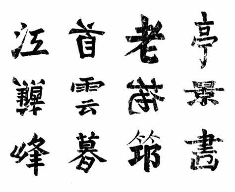

我在美国超市看到了一个坐在展示沙发捧着书的孩子

-> 美国小孩真用功啊｜展示沙发能否长期占用？｜孩子父母哪去了？｜这是本什么书？

走近了，发现小孩在看的是书里的手机

-> 果然是伪装｜为什么要在书里夹着手机？｜这是伪装给谁看？｜是父母的手机吗？

走再近一点，发现手机屏幕里是短视频

-> 果然短视频对小孩子具有成瘾性｜仅仅是小孩子吗？｜现代人太需要即时反馈了

又走近了一点，听到小孩看的是游戏类短视频

-> 果然游戏害人，要把这个跟短视频一起禁止｜什么游戏会这么吸引小孩子？｜美国下一代完了

跟小孩聊了下，才知道他是某款游戏的职业玩家

-> 电子竞技是正式比赛项目了，要对下一代宽容｜这也是一种学习｜不务正业

这时父母来了，聊了下发现孩子撒谎了，孩子就是想玩游戏

-> 看吧，上瘾后都会撒谎了｜父母就不会撒谎吗？｜游戏是褒义还是贬义？

上面这个片段是日常生活中经常发生的，很多事伴随不断的了解，你会产生完全不同的观点或者不断反转之前的观点，同时你也会遗忘掉最初那些疑问，在了解事实的过程中其实也在收缩你的观点逻辑线。在这个场景里，当走到后面几项观察后，你已经不关心那本作为伪装的书是什么了，如果是一本《花花公子》，我猜你会毫不犹豫拿出手机拍下来发个配图朋友圈的，也根本不会进行到下一步的观察。很多时候，与其说我们在观察社会，不如说在期待发现与预期吻合或反常的故事，用来打破日常琐碎带来的无聊，这其实是对所有所谓客观观察的讽刺。与其说我们成功从日常观察中形成了观点，不如说我们的生理限制没法同时分析很多同一现象背后的问题，伴随信息的不断获取，我们只能形成一个最符合逻辑的观点，这个过程中很可能捡了芝麻丢了西瓜。

写上面这段是因为周末看了本挺神奇的漫画《非平面》，这本书即是漫画也是博士论文，也有中文译本，核心其实就是说认识世界的角度是多元的，但同样的道理用不同表现方式展示的效果也是不一样的，用漫画来展示还是挺有意思的。翻一遍不超过一个小时，但相信很多画面与文字会让你印象深刻，同样的可能也放弃了很多画面中表现的支线观点。我虽然是个艺术盲，但在博物馆看画的时候也能体会那种超越语言的交流方式及其中蕴含的丰富信息，很多可能作者自己都没意识到。毕竟不同年代的日常是差别很大的，画家描绘的理所当然的东西在后人眼里可能恰恰是非常奇怪的，一个艺术作品就是一个时代剪影，甚至作者自己也是剪影的一部分，他以为是在表达自己的感情，但其实里面会展示出创作年代的背景信息。但很多这类解读都是很自我的，不适合拿来进行标准化测试，很容易出现作品作者自己做自己文章的阅读理解题都做不对的情况，毕竟答案反映的是出题人的理解与时代背景。这不仅仅在文科成立，理工科很多知识也是不断发展的，同一个问题上世纪的标准答案跟这个世纪的答案就完全不一样，例如太阳系有几大行星或中心法则的方向性。

岔个话题，除了绘画，音乐也是能超越语言文化进行交流，无奈我也是个乐盲，而游戏也是可以跨语言交流的，例如围棋有个别名叫作手谈，不用语言也能互相搏杀，当然我也不懂围棋，再比如手语或盲文，也可以跨文化交流，理科语言也是，我们在任何地方写H2O对方都知道是水，不需要知道英文或德文，编程语言也类似，任何国家的程序员看到 hello world 都不仅仅知道这是英文，而是含有一种程序可运行的额外意义，这些符号系统或规则系统也能交流信息。我们的学习过程其实在这个视角下就是在学一套交流规则，只是恰巧还能解决些实际问题。当然，我还是希望别搞黑话系统，能交流的人越多，越可能产生多样性并发掘出交流规则本身的潜力，同理，也不要小看人口问题，小概率才能出现的人才与创新产生的概率是相对稳定的，人口基数越小，改变未来的可能性就越低，当然，如果人工智能可以通过仿真模拟来替代以人口为基础的创新模型，那么也不用太担心，毕竟智能的进步不一定需要人类这种载体，智能需要解决的终极问题可能就是寻找存在的意义。

书里提到文字的表现力是弱于图像的，这点我并不是完全认同。语音可以认为是单一维度有前后逻辑的，但书面文字堆到一页纸上后也具有图像式的表现力，字母跟象形文字也不一样。这里面最出名的可能就是苏轼的《晚眺》：

这首诗乍看不像诗，字也歪歪扭扭还有错别字，但翻译出来就是：

长亭短景无人画， 

老大横拖瘦竹筇。 

回首断云斜日暮， 

曲江倒蘸侧山峰。 

这种表现形式叫做神智体，类似的作品网上还有不少，这点上字母文字就很难实现了。同样，字母文字在发音上会更流畅些，单一字母没有具象意义，听的人要从整体去感知意义，对思维逻辑性有要求；象形文字发音就相对独立，听起来有颗粒感，一字一世界。印象中十多年前网上有过字母文字与象形文字优劣的比对，有意思的是对优劣最执着的是理工科的人，又是算信息量又是算传输效率啥的，文科的人对不同观点的包容度反而更高。其实价值判断都是针对场景才有意义，单纯一个概念根本就没法讨论优劣对错。例如前面说的神智体，对于初次看到的可能会觉得里面有文化与创作空间，但对另外一些文字工作者他们本能就不接受错别字跟非标书写，压根就不认为这是有意义的东西，一句过时技术就盖棺定论了。

这其实无所谓，寻求意义本身有时就是无意义的事，很多所谓的意义也不过是一厢情愿，意识到这一点就足够了。生活中实时发生的事本就是千头万绪，不同的知识背景与不同的人生经历自然会解读出完全不同的东西，不要指望简单照搬别人的话或经验就真的“知道”或“认识”了某件事。哪怕我们是某件事的缔造者，可能也不是最理解这件事的人，纠结于自洽性、叙事性与逻辑性是很难发现没看到的风景的，更多时候是周旋在各种观点主义的胜负之间，忽视了更重要的问题。
