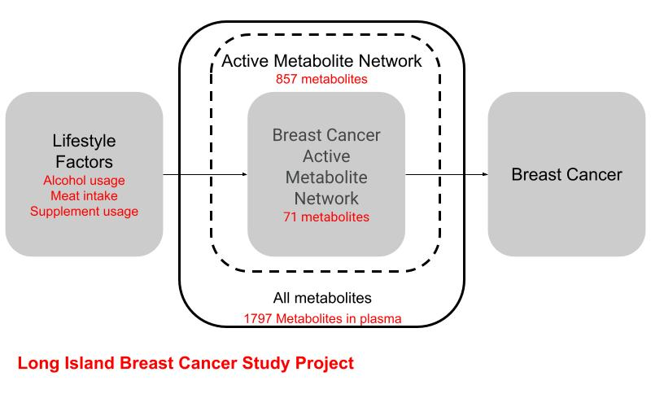
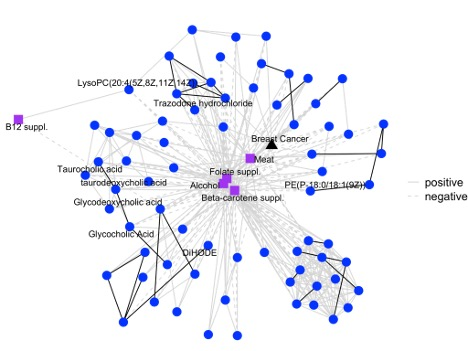
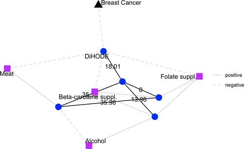

构建暴露与健康效应的关系是环境健康研究的一个重要方向，方法学上其实非常类似分析流行病学（analytical epidemiology）。相比而言，分析流行病学里对暴露或者说病因的定义相对更宽泛些，很多直接来自调查问卷，指标相对宏观，例如抽烟、饮酒等，而在健康效应这一端也是相对宏观的指标，例如是否得病。宏观指标定义偏定性，灵敏度相比定量指标低一些，因此为了得到靠谱的结论通常需要较大规模的样本量与良好的实验设计来规避混杂因素。环境分析化学视角则更关注分子水平的定量指标，例如某种污染物在人体样品中的浓度。相比宏观指标，环境分析化学的定量数据通常可以提高构建暴露与健康效应关系的灵敏度，近些年很多环境健康研究已经直接用分子水平的污染物浓度来替代调查问卷以构建污染与疾病关系。同时，环境生物样品中其实同时包含外源暴露及内源代谢的信息，可以通过组学手段测得，有助于直接从分子水平解释宏观健康效应的形成机理。大多数内源代谢物是进化保守的，对外界刺激并不不敏感，但也有少数代谢物可以对外来暴露做出响应。在之前的研究中，我将这部分小分子命名为“看门人分子”，用来表示对外暴露敏感的少数内源代谢物并开发了提取“看门人分子”的方法，这项工作发表在[ES&T](https://doi.org/10.1021/acs.est.1c04039)上。当时我认为掌握了人体的“看门人分子”，其实就掌握了体内响应外来单一或多暴露的一般性分子机制，然而新的研究却出现了新的挑战。

这项发表的工作是基于我同事分析流行病学的研究，那项研究基于队列数据分析发现生活方式与乳腺癌有相关性。这次我们想通过对血样的检验来讨论其影响的分子机制，我们从队列里找了50个乳腺癌患者与50个健康人，一共分析了100个血液样品。然而，当我重新构建乳腺癌与生活方式的宏观联系时，我们没有发现直接的关联，这一方面是因为我使用了原始数据而非之前研究中提出的生活方式指数，另一方面则是样品量远小于之前的队列，宏观指标分析上关联性的灵敏度偏低。也就是说，对暴露敏感的“看门人分子”很少直接跟疾病相关。同时，我发现有些内源代谢物直接与疾病相关或者对疾病灵敏度高，是疾病的“看门人分子”。现在的问题是这两类看门人分子之间的关系不知道。

为了应对以上问题，我将“看门人分子”概念推广到了“活性分子网络”模型，也就是改用定量分子信息来构建一个已知环境健康联系的分子机制。例如，暴露A影响了其看门人分子甲，看门人分子甲会调控分子乙与丙，分子丙会去影响分子丁，而分子丁是疾病的看门人分子。换句话说，样品里小分子虽然很多，但其中只有互相有联系的分子才能传递影响到宏观表型，这部分存在互相关联的分子更有可能揭示环境暴露对疾病影响机制。反过来讲，如果我们分别测到暴露与疾病的看门人分子，但这两种分子之间不存在任何联系，那么也很难得出暴露会影响疾病的结论。这里的分子可以是代谢物，也可以是蛋白或表观遗传修饰，但不论是什么，如果无法构建分子网络，我们就无法真正从分子机理角度解释暴露影响健康的过程。如下图所示，“活性分子网络”模型优先关注分析得到的存在互相作用的分子并构建出它们在样品中的分子网络，然后分别计算外来暴露与疾病的看门人分子，如果这两类看门人分子存在于同一个分子网络上，那么我们就从数据端直接得到了暴露影响疾病的分子机制。这一过程类似效应引导分析，由已知的宏观变量与数据内生结构去逐级筛选测到的小分子，而经过筛选后的活性分子网络具备一定的可解释性。

*本研究中活性分子网络模型示意。生活方式乳腺癌相关活性分子网络只是所有测到的代谢物中的一小部分。*

那么剩下的问题就是技术上如何实现活性分子网络的构建与看门人分子的发现了。对于第一个问题，从纯数据角度，活性分子网络只能依赖相关性构建，但从环境化学角度，我们还可以用分子间质量差对应的化学反应来解释机制。在这项研究中，我优先使用了相关性来构建分子网络，毕竟如果两个分子都没有相关性，后面的化学分析也很难成立。在合并了正负离子模式数据并排除掉冗余峰后，我们得到了1797个未知代谢物，通过构建分子网络，约一半的代谢物不与其他代谢物有任何相关性，排除掉后就得到了构建样品中分子活性网络的857个未知代谢物。对于第二个问题，之前研究我们是通过线性模型来找每一个代谢物与每一个暴露的关系，但在这项研究中，我们引入了lasso算法来一次性构建疾病与所有活性分子网络代谢物的模型，由于lasso本身可以用来做变量选择，我们就直接得到了跟疾病相关的所有看门人分子。这里其实可以替换成其他具备变量选择属性的机器学习算法，这样可以更好处理这种数据本身带有一定相关性的情况。因为这些分子本身就属于某个特定相关性网络，我们将这一步得到的疾病分子看门人与活性分子网络结合，就得到了由71个代谢物组成的跟疾病相关的活性分子网络。下一步，我们继续用lasso算法检查这71个代谢物与所有生活方式的关系，就得到了从生活方式到疾病的分子关系网。也就是说，分子间关系是用解释性强的相关性构建的，而宏观暴露/疾病与分子间的关系是用机器学习模型搭建的，这就形成了借由小分子相互作用构建的暴露影响疾病的通路。

*在乳腺癌活性代谢物网络（BC-AMN）中，生活方式、乳腺癌和代谢物之间的关联。代谢物与生活方式/乳腺癌之间的边框是 LASSO 确定的关联。代谢物之间边框由相关性决定。黑色边框表示的质量差（PMD）与常见 KEGG 数据库反应中的 PMD 一致。*

在这个网络里，我们用二级质谱鉴定出了8个代谢物并重点讨论了跟乳腺癌相关的DiHODE网络，这个小分子网络里有5个代谢物，但跟饮酒、肉还有两种保健品都有联系。虽然我们没办法鉴定出这5个代谢物具体都是什么，但根据基于质量差的反应组学可以推测出这些代谢物间存在水解反应，也就是水解酶参与了生活方式与乳腺癌间的关系。也就是说，即使我们无法鉴定出环境暴露与健康间活性分子网络是什么，但依然可以从化学反应角度推测影响机理。通过文献调研，我们也找到了一些DiHODE引发炎症反应及不同生活方式对炎症产生影响的证据，也就是说，具体到这个小的乳腺癌活性分子网络，其分子机理可能同时涉及炎症反应与水解反应。当然活性分子网络只是个理想模型，“活性分子网络”的基本假设是要能尽量多的测到分子信息，如果我们只关注了小分子，那么涉及大分子的信息就缺失，进而造成网络不全面，但如果我们拿到的是多组学数据，这个假设就更可能满足，当然，这就是后面要做的工作了。

*生活方式、乳腺癌和涉及 DiHODE 的代谢物之间的关联。代谢物与生活方式因素或乳腺癌风险之间的边框表示关联，而代谢物之间的边框表示相关性。黑色边框描绘了质量差（PMD），这些差异可以用 KEGG 反应中的 PMD 来解释。*

本[工作](https://pubs.acs.org/doi/full/10.1021/envhealth.3c00218)由美国国立卫生院支持，特别感谢长岛乳腺癌研究队列提供的样品与数据，论文支持信息附带了开源数据分析的R代码方便读者重现。