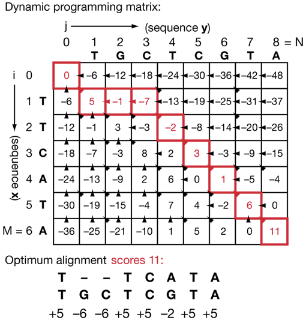

最近属于过敏季，经过几次出门流泪打喷嚏，我还是放弃了非必要外出，宅家里整理我那永远整理不完的笔记。这次是关于动态规划的，这个笔记是给非计算背景的人（也包括我）整理的，主要目的是假设将来会遇到类似问题，此时可以去找计算背景的人或AI写算法解决。

这里不去解释动态规划这个名字有多差劲，实际上这也是美国人为了忽悠国会议员搞出来的高大上词汇，动态规划本质就是个特定问题的寻优过程。这里的特定问题有两个限制条件，第一个是大问题可以拆成小问题，第二个是小问题的答案可以存起来方便快速计算，科研人员要知道怎么搞第一步，然后第二步就属于技术人员的工作了，目前实现方法与算法非常多，当前动态规划的最大应用瓶颈在于懂第一步的不懂计算，懂第二步的不知道能拿来解决啥具体问题。这里最重要是形成科学问题与计算问题的关联性思维，看到实际科学问题可以转换为可计算问题，这样可以提高解决问题的效率。

这里我从具体的科学问题出发，这里有两段基因序列，现在我想进行序列比对该怎么做。不懂计算的科学家一般都是大力出奇迹，也就是我直接把所有可能的比对情况列出来，然后看哪种靠谱。这里面可计算的点有两个，第一个是穷举所有可能的比对，第二个是量化“靠谱”这个词。先说第二步，序列比对问题里的靠谱需要设计一个打分系统，例如两个碱基如果配对给5分，如果不配对给-2分，如果出现插入或删除给-6分，这里的分数设计需要科研人员按学科知识进行设计，例如你认为插入或删除对于你研究的某个进化上极端保守的序列不太可能出现，那么你可以给一个-10分。这块的知识加权关系到你对问题的认知水平，如果科研人员完全不了解算法，用一个奖励突变的比对算法研究进化保守的序列，比对出来的效果可能就跑偏了。

回到第一步，这种大力出奇迹的思路不太适合21世纪的技术水平，对于简单问题穷举还有可能，当你去比对数据库时一个一个查就属于开玩笑了。这里要做的是把科学问题翻译成可计算的步骤，还是序列比对，每个序列都是ATGC的排列组合，例如两个序列是TTCATA跟TGCTCGTA，T跟T匹配上就给5分，插入或删除就-6分，下一个一边是T，另一边是G，如果我们认为这是错配就给-2分，这样加第一步5分总和就是3分，如果我们认为这里存在错位或删除就给-6分，这样加第一步5分总和就是-1分，如果我们认为第一步也是插入或删除，那此时总和就是-12分。此时我们需要构建一个比对矩阵，把两个序列逐步比对后的得分从左上到右下一直到比对完成全部算出来，矩阵里的分数就是比对到这里所有步骤的得分总和。

*图解动态规划（https://doi.org/10.1038/nbt0704-909）*

到这一步完成，我们直接就找到了右下角的11分，这个分数最高，说明这个分数的形成路径就应该是所有比对中最有可能的那一条。此时我们要反推这个11分是怎么来的，因为每一步我们只可能通过5，-2与-6三种情况得到，此时我们从11分出发倒推回起点就能知道路径。也许你会问到了3分那个点为啥不走2分那个路径？很简单，这个路径需要1分，而你能走的路径只可能是5，-2与-6，而2分那个点只可能来源于0分走错配途径，这条路径到不了最高得分。这里要注意最优路径可能不止一条，得分可能相同，此时算法可能会进行随机选择或者按照具体研究需求来限定某种顺序可能性更高，也就是二次打分，这需要科研人员参与算法设计。

同时，这个找到最优序列的过程本质上就是动态规划。从任务拆分上，我们先把全序列比对拆成了第一个碱基与后续序列比对的两个子问题，然后后续序列比对又拆成了第二个碱基与后续序列比对的子问题，以此类推到最后一个碱基比对的问题。你可能会说递归计算也是这个套路啊，没错，动态规划某种程度上跟递归相似，但我们回顾下计算过程，当我们拆分序列时，几乎一定会出现有些序列是相同的。我们第一次拆分有三种情况，情况1是匹配上了，情况2是没匹配上，跟第二个序列第一个碱基是删除，情况3也是没匹配上，但跟第二个序列第一个碱基是插入。这里我们不是讨论得分，单纯是任务拆分。从情况1往下走又会有这三种情况，其中一个是下一个是删除，而情况2往下走也是三种情况，其中一个是下一个匹配上了，而这两种下一步情况后续的计算是完全相同的，剩余比对的序列都是考虑一个删除的序列。在递归的思路下，你需要重复计算这两种情况，但动态规划寻优时会设计一个存储单元来存储所有计算子任务，如果两条路子任务相同，那么只计算一条子任务一遍就可以了，用空间换时间。对科研人员这属于技术细节，但你需要知道什么时候可以用这个算法以及如何把问题抽象成现有算法可解决的问题。

上面这个属于生信，我再讲一个分析化学的案例。我这里用质谱测到一个物质的荷质比，但我想知道其元素组成，该怎么办？这属于比较经典的找零钱问题，打比方我有1元、5元、10元的零钱，你想要123元，问如何凑钞票最少。而我们的问题就是我知道一个质荷比是100，如何用不同单个原子凑出这个质荷比，此处还要设定其他限制条件，例如要保证碳原子数跟氢原子数比例符合某个范围，毕竟全用氢原子你啥都能凑出来，而且要考虑同位素丰度。这些信息都是需要科研人员转成计算问题的。

那么我们能不能用动态规划来解决这个问题呢？当然可以，我们那个质量数可以分拆成一个碳原子跟其他的组合，最后递归到最后一个原子，这保证了动态规划问题的可分拆性。而我们分拆的过程是被化学规律也就是原子质量数限制了搜索空间，其中单个氢原子跟单个同位素剩余质量在计算上考虑不确定度可能是相同的，存在重复计算要素，因此可以设计对应算法来反推出元素组合。此时不同算法的优劣主要在于其考虑的化学限制条件，条件越多越贴近某种事实，这些也是科研人员需要了解的。

其实对于科研人员，理解动态规划的关键不在于其技术上的实现，那是技术人员的饭碗，科研人员要更熟悉算法思想与应用范围，这样才能在碰上类似问题时触类旁通，知道找谁解决，但同时也没必要去抠太多技术细节，这碗饭不是你该吃的。
