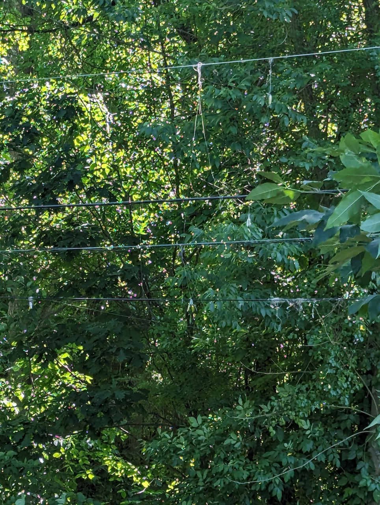
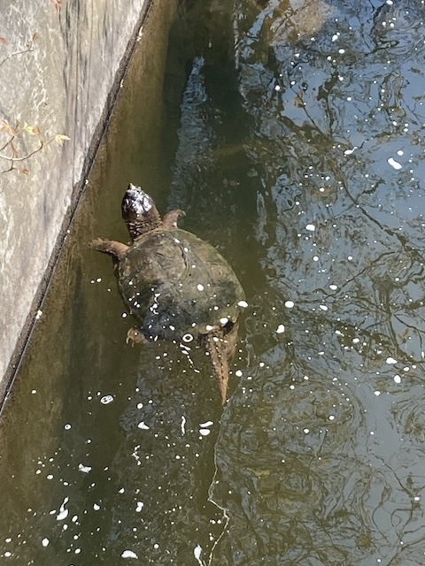
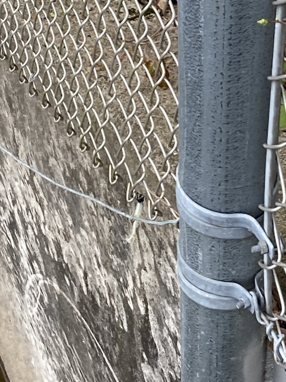
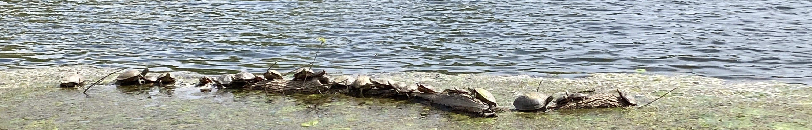
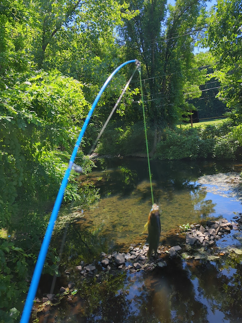
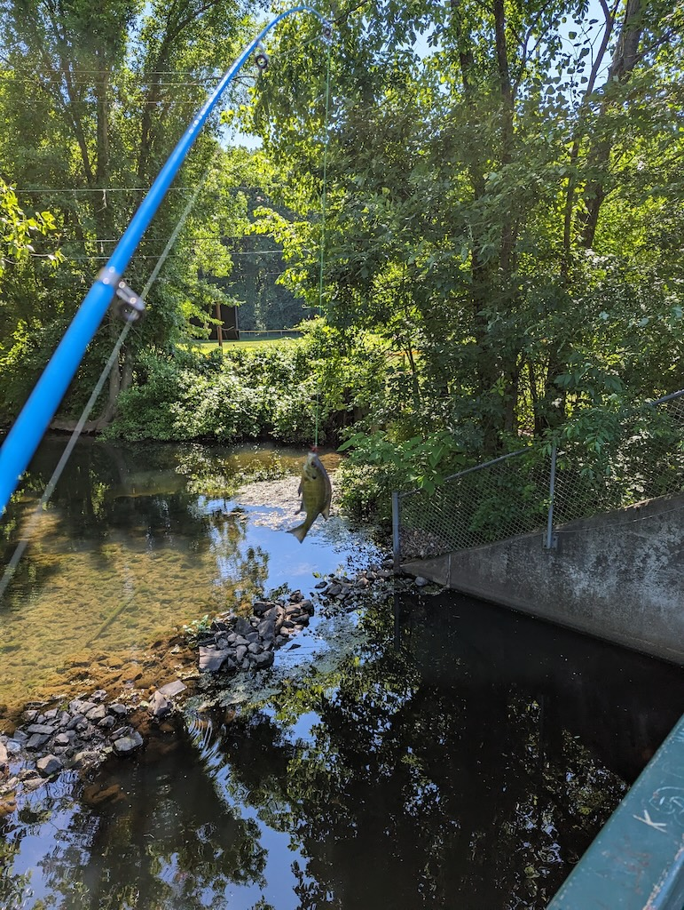

## 4月14日

购买钓鱼年证，海陆通用版。

## 4月20日

购买鱼浮鱼坠，傍晚首次在家边池塘钓鱼，旁边有人钓鱼，我钓了他1000倍，他一条也没钓到。啥也没有，散会。

## 4月21日 

早上尝试垂钓，水流湍急处，最后鱼钩卡石头里，剪断鱼线，损失鱼钩假饵一套。总结经验，需要子母线，看视频学习绑鱼钩方法。

## 4月22日 

钓鱼，没钓上来，差点又断线，需要放一下线再收，看到前人挂在电线上的鱼钩尸体。

## 4月27日 

钓鱼，首次看到鱼，有小孩在旁边钓到了鱼。下午去中超买棉花糖，再钓发现乌龟，大鱼 ，但不吃棉花糖。甩钩因为子母钩不牢把钩甩出去了，损失鱼钩假饵一套，饵有问题。

## 4月28日 

用猪肉馅与面做鱼食，发现不沾钩。发现两只龟，小鱼不咬钩，树荫下挂树枝后挣脱 ，心惊胆颤转到水坝处，鱼钩挂铁网，再损失鱼钩假饵一套。

## 5月4日 

去附近另一个公园，发现有一排乌龟晒太阳还有绿头鸭家族，还有不少垂钓，回到家去附近看到鱼仍然不咬钩，旁边有人钓了只龟，一脸懵逼不知道咋把钩拿出来。

## 5月5日 

买到小钩与鱼食，知道鲤鱼鲶鱼要用钓的，鲈鱼可以路亚。

## 5月11日 

康州免费钓鱼日，上午人少，鱼食会被吃，但不上钩。下午人多，没钓到但旁边一家的小孩钓到了。还有父亲钓到了当鱼饵钓大鱼，看到鹭、天鹅、蛇、绿头鸭，线打卷拆线拆了半天，颗粒无收。

## 5月17日 

前三天下雨，池塘水量过大，看不到鱼。

## 5月18日 

早起钓鱼，下雨，甩了几杆回来了，研究钓鱼视频

## 5月22日 

下班钓鱼，周围有fly fishing的少年，几分钟两条鱼，比划说自己钓过四五十厘米的，能看到鱼咬钩但还是不上钩。

## 5月26日 

午后钓鱼，看到青蛙，看到鱼吃浮萍，鱼刺伤了手，挂彩。推测活饵效果应该好，搞清楚鱼饵用法，探底后浮起，购买小钩、铅坠、假饵与浮饵。

## 6月1日 

午后喂鱼，鱼吃饵，追饵，但就是不上钩，需要配重。

## 6月9日 

买roaster tail，继续喂鱼，缠树枝断了线，损失一只爪钩，小钩爪钩飞虫都不行，周边陆续有人上鱼，放生水草5小时，心态快崩。

## 6月10日 

尝试米诺假饵，不沉水，天下大雨浇回家。

## 6月15日 

尝试飞蝇饵，浮水钓鱼，上鱼！鲤鱼！两条！一大一小！一手鱼鳞！用剪刀钳拆钩，放生。

## 6月16日

重新钓，没钓到，碰到一对常年钓鱼的父子，父亲钓到了昨天我钓到的鱼，问了下是Bluegill，蓝鳃太阳鱼，可以吃，腮上有个明显黑点。

## 钓鱼十诫（双语版）

- 永不空军 Release aquatic plants
- 永不放弃 Cut the line when your line is twisted on the tree, boy
- 带上证件 Never talk about your age
- 终身学习 Just cast your rod
- 无惧伤痛 Call your Mom when get hurt by the hook
- 注意天气 blame the weather
- 尊敬对手 blame the guy besides you
- 尊敬鱼 You can always have fish and chips in one restaurant
- 单杆单钩 Be single, man
- 放生钓到的鱼 catch and release before you really catch a fish
