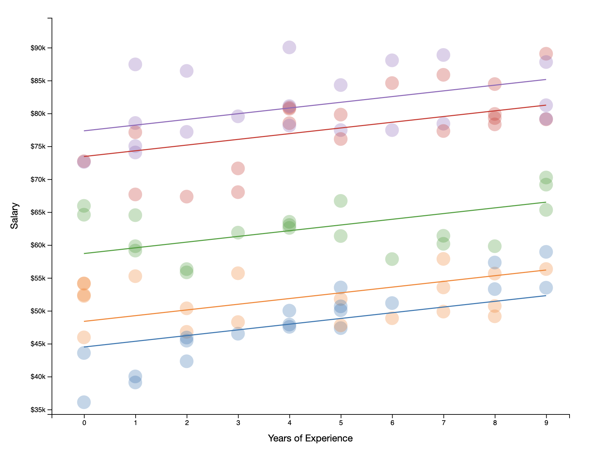
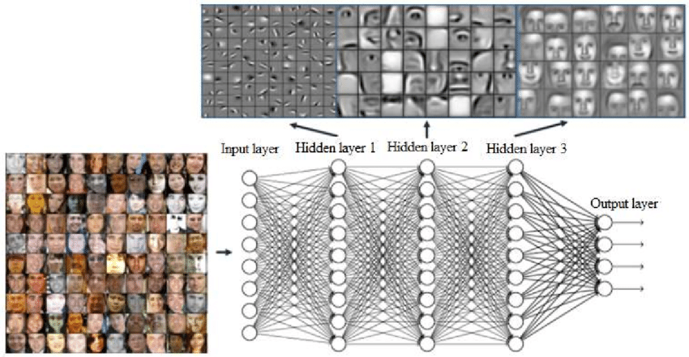

层级模型可能是面向普通人直观理解数据分析模型的天花板，往后的模型都需要至少简化到层级模型才具备一定的可解释性。那么什么是层级模型？最简单的理解就是数据内部不是均质的，例如你是一个刚到地球的外星人，随机大街上抓一百个人测量身高，想看看地球人能长多高。那最起码要区分下年龄层，未成年人身高跟成年人身高去搞平均，得到的数据相信自己看了也不信。也就是说人群身高这个变量天生要考虑年龄来进行分层，成年人几乎不变而未成年人每年都长高，在定义人群身高概念时就得考虑数据本身内部的分类，这种内生性分层在很多具体的学科概念里很常见。

之所以引入层级模型，很大程度是因为多数学科知识构架都是从基本概念堆起来的，学科或某个议题本身就是个层级概念模型。例如讨论环境影响健康，首先环境因子得暴露给人群，人群被暴露后会有应激反应，生理上可阻挡大多数进化上已知的危害，但仍然有些污染物不被阻挡，进入人体后会干扰具体的代谢过程，当代谢紊乱后生理上出现病症。这一系列的步骤都要有观察或实验证据来证明才能形成一条完整的环境影响健康的层级机制模型，有些污染物也许能在环境中检出，但根本就不出现在人群生物样品里，那么就不具备进行讨论的价值。现在环境科学里流行的效应引导分析就是要先看到最终影响再去找具体污染物，前提就是层级模型要可验证，否则单纯因为环境有就说有危害是很容易被质疑的。

除了机理上的层级模型，另一个很常见的预测性层级模型就是决策树。当你决定今天是否出门时，脑子里可能同时出现天气、心情、交通方式、家务劳动等变量，这些变量的优先级是不一样的，例如天气不好就不出门了，此时心情或交通方式根本就不需要考虑了，如果还有家务劳动，那可能也不用考虑天气了。当存在变量优先级时，数据也是要用层级模型来建模的。在很多具体场景下，有些变量在不同层级上可以反复出现，例如医疗资源紧张时，急诊室会首先按紧急与否预筛患者，哪些一时半会死不了的就得等等，然后按年龄，老人小孩有高优先级，然后可能又要细化评估紧急的严重程度，一个胳膊折断的哭闹熊孩子跟一个摔倒后昏厥的老年人哪个优先就要看具体医疗资源状态了。

决策树模型在很多机器学习算法里都有体现，很多时候我们不知道变量的层级关系，就预设其存在层级关系然后用数据进行训练。每一层的节点代表一个分类标准或特征值的判断标准，树的枝叶代表最终给出的响应。在机器学习的预测模型y=f(x)中，y代表最终响应，x代表跟响应相关的特征或属性，f则代表一种模型算法。f的构建过程可以看作寻找一种让响应相对一致的特征分类或回归方法。决策树里每个枝叶的形成过程所经历的特征判断就是“寻找一种让响应相对一致”的过程。

这个过程实现的具体过程大概要用到自上而下的贪心算法。具体而言就是首先找遍历所有不同的x，在每个特征x下找出最小化响应y的均值与实际y差的平方的一个特征x0，这样就实现了响应的第一层二分，也就构建了树的第一个主分支，这个过程在不同分支上递归进行就可以训练得到一棵回归树。分类树的构建与此类似，不同的是要引入分类错误率的概念或者说y分类的内在均一度作为训练目标。训练过程可以引入类似lasso或岭回归或弹性网络的惩罚项，最后当我们得到一颗训练好的决策树后就可以进行预测了。

预测过程更加直观，我们用手头的x去对应节点上的判断标准进入不同的分支，递归进行，最后到枝叶上就是预测结果。值得说明的是这种层级结构有些变量基本用不到，因此决策树生成过程也可用来进行变量的筛选并对其重要性进行评价。

除了机理跟预测，分层这个思路在具体研究中也很常用，例如组学数据里的小样品大维度场景。假定我有两组样品，一组样品6个样本，每个样品测代谢组测到上万个代谢物，此时你每组样品去做类似t检验的差异分析会面临两个问题。第一个问题就是错误发现率（FDR）得控制，因为随机做上万次t检验会有大量假阳性。第二个问题就是样本量带来的，虽然t检验用的分布属于厚尾分布，但在样品量少的情况下对单一代谢物的方差估计很可能非常不靠谱，这样也会引入大量假阳性。层级模型可以用到第二个问题上，基本假设就是代谢物之间虽然有差异但毕竟都来自于同一个样品，存在一个基于样品本身的代谢物间总方差，我们可以先估计出这个总方差。当计算具体代谢物的方差时，我们用总方差对代谢物原方差进行加权收敛，得到一个介于所有代谢物方差与单一代谢物之间的新方差进行差异分析。此处的层级模型在于除了对代谢物本身表达建模外还要考虑更高一层所有代谢组表达建模，这样在进行差异分析或统计推断时实际上考虑了代谢物跟代谢组两个层级的方差来源。这个思路经常被称为经验贝叶斯，本质上是借用了更高层级下其他数据的信息与本层级数据信息进行混合，进而得到一个和稀泥的推断，这对于小样品量的实验其实很有用，当然就算用了层级模型，一样还得进行错误发现率控制。这里类似进行了正则化，对方差进行了惩罚。经验贝叶斯收敛可以用mcmc方法做的更好。

与这个思路类似的就是线性混合模型。在估计斜率固定效应时，可以假定每个样品的截距来自于一个随机分布，或者反过来固定截距，认为斜率来自于一个分布。甚至同时认为斜率与截距来自于一个分布，然后给出对其方差的估计。举个例子，人群中某污染物浓度随暴露时间而线性增加，此时斜率固定，但每个人本底不一样，也就是截距不一样，此时如果不预先对所有截距建模，那么对斜率的估计很可能也是错的或不显著的。实践中如果涉及对同一个体的反复测量，那么几乎一定要把不同个体间的随机效应参与建模。这里层级模型就体现在对于个体参数估计是构建在更高群体层次上，把群体存在的随机效应也放到模型构建里去，此时得到的模型的固定效应可能会更靠谱些。本质上很像先聚类再分析，但会考虑不同聚类间的信息共享。

不同部门间工资建模就是个层级模型。

层级模型到了深度学习时代也有其地位。例如，多层感知机构架里如果各层之间的激活函数不是非线性的，那么这个构架可以看出一个多层线性模型。很多多层神经网络结构本质上也是在对数据进行降维简化与抽象，例如一个编码器构架可以把很高维度的数据进行降维然后再通过解码器重构，这一降一升实质上对于噪音消除效果不错。另外就是如果对图片分类的神经网络不同层可视化，可以看到前面的层感知到的更多是基本线条，越往后越接近人对图像模式的感知。

卷积神经网络各层的感知状况，图来自[网络](https://dergipark.org.tr/en/pub/aita/issue/70791/1137977)。

关于层级模型这种建模思路可以聊的还有很多，例如随机森林就是层级模型的进阶变种，分析文献的荟萃分析本质上也是线性混合模型……虽然层级模型可以应用的场景很多，但形成这种程度对数据的理解可能需要实际项目的训练。

*推荐阅读*

- [Analyzing 'omics data using hierarchical models](https://www.nature.com/articles/nbt.1619)
- [层级模型可视化](http://mfviz.com/hierarchical-models/)
