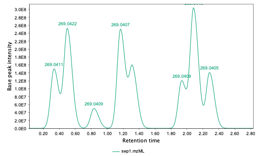
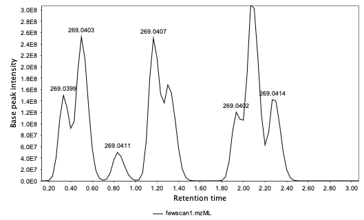
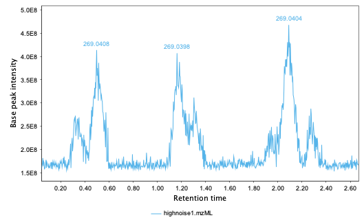

做过小分子代谢组学或非目的分析的人大概都有一种体会，那就是数据处理软件不同，得到的结果往往也不同。究其原因，非目的分析这个名词就预设了分析方法是没有预设要检测到化合物的，因此基本是软件检测出什么就报什么。而不同的软件对于原始数据的处理方法并不一致，因此就会出现同一份数据但得到不同处理结果的情况。

如果倒退十年，市面上常见的一级质谱峰提取软件除了仪器厂商自己开发的，基本就是xcms跟MZmine两家，后来OpenMS填补了一部分python用户的需求。然后深度学习的风终究还是吹到了质谱数据分析这边，最近几年的峰提取软件很多都是直接套了一个CNN或transformer的内核来进行识别。这类文章很自然就是要验证自己的效果，然后又是因为非目的分析拧巴的本质，验证基本就是三条思路，要么就是用标准物质进行验证，要么就是定义一个独立的统计量来评价峰的质量，要不就是跟其他软件交叉验证。然而标准品可能覆盖不到未知物，定义的统计量会偏向于特定算法，交叉验证更是很难给出到底哪家最好。

那么，其他学科遇到类似问题会怎么办呢？很简单，就是数据仿真或数据合成。真实样品里的信息我们永远无法完全搞清楚，那就直接生成一个我们能搞清楚的。具体到小分子代谢组学或非目的分析，一般都要加上色谱柱进行分离，这样我们的任务就变成了仿真色谱质谱数据。那么这类数据如何生成的呢？只考虑一级质谱，数据其实就是由带时间戳的全扫描质谱组成，这样我们首先要找到一些小分子的质谱谱图，然后在时间维度上将其展开成一个高斯峰就可以了，将这些数据组合就成了一个内含物完全已知的人造样品，每个物质的出峰时间、峰宽、峰高、信噪比、响应因子全都可以人为控制。当然，背景噪声也是必不可少的，我们可以提供一组来自真实实验的背景离子去模拟其色谱，叠加上测量荷质比的不确定度（20ppm QTof 5ppm orbitrap），这样我们就可以生成一个最基本或者最理想的质谱数据，这样只要让不同软件来识别一下就知道哪个更好用了。

我最近的一项工作就是生成这种合成数据，刚刚发表在[AC](https://pubs.acs.org/doi/10.1021/acs.analchem.5c01213)上，也有免费的[预印本](https://www.biorxiv.org/content/10.1101/2023.11.14.567024v3.full) (这个版本比发表版本少了一个基线分离测试章节，但多一个冗余离子章节)，目的就是提供这样一个仿真小工具。因为仿真的峰几乎就是完美峰形，这样的峰如果还找不到，那么也就没必要说自己更好用了。当然，除了完美峰形，这个工具也可以用来仿真拖尾峰与前伸峰。这里被仿真的实验数据来自MoNA跟HMDB的一级质谱数据，因此你会看到真实物质的冗余峰。因为文章只是个字数受限的技术报告，我简单对比了下几个常见软件的表现，虽然他们大部分能找到该找到的峰，但也会找到很多本来不存在的峰，这个假阳性问题的简单解法就是多用不同软件来找，然后只去关心他们都能找到的那些峰。然后我也对比了这些软件在识别裂头峰或其他非基线分离上的表现，只能说不太理想，会丢掉一些峰或找错峰的范围。要知道这些数据已经是简化过的了，这个表现让我很难直视之前基于这些软件发表的结果，目前看每个软件都有一定改进空间。因为没钱，商用软件没测，估计也好不了哪去。

这个小工具存在的意义除了用来验证软件表现，另一个则是为深度学习提供饲料。AI4Science现在一个卡脖子的地方在于实验数据有限，很多实验也很贵，同时也会被实验室条件锁死，这使得A实验室里训练出的模型在B实验室几乎不能用，实验数据天然就会过拟合所在的实验室条件，甚至换个操作员都会有批次效应。如果我们的目标是一个通用质谱数据模型，那我们就需要合成出保留时间完全不固定且出峰质量千奇百怪的数据用来提高模型的稳健性。这点其实是借鉴了去年 deepseek 强化学习的思路，就是天然语料缺失或多样性不足，那我就仿真出来。当然这个工作还在进行，需要的合成数据量也非常大，真要是让实验室进样来生成，开支会失控。当然，这个小工具还有很多其他用法，有时我会用合成数据来快速验证一些有意思的想法。下面会展示非基线分离、扫描循环不足还有背景噪音高的仿真效果，这部分是给审稿人看的，不在正文里。

我很讨厌喂饭式给结论，所以这篇文章里所有分析的代码与数据也是公开的，放在zenodo上[自取](https://zenodo.org/records/15733247)，不放心我的结论就自己验证，因为有预印本的原因已经被下载九百多次了，看起来关心这问题的人不少。

Ps. 这项工作算是兴趣使然，虽然是我的研究领域，但目前给我发工资的项目都跟这个无关，你可能注意到这篇文章没有任何资助，一作跟通讯都是我，属于给自己挖的坑。这稿子经历过拒稿重投，被审稿人的合理或存疑的要求搞得面目全非，但总算发出来了。我做软件工具的理念很简单，首先我得用且对我长期有用，因此我后面肯定还会维护，毕竟现在在做的另外几个自带干粮的项目都需要这个工具提供验证，只是从此实验数据就可以自给自足了。

Ps2. 这个工具目前只能生成一级质谱数据，二级质谱数据的仿真会复杂很多，同时我也认为如果一级质谱数据挖掘得当，很多问题就已经可以回答了，二级的鉴定属于锦上添花，属于分析化学人的某种坚持。
