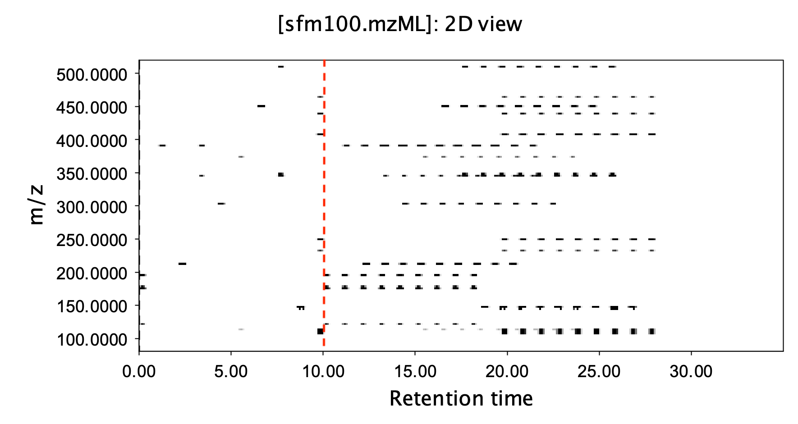
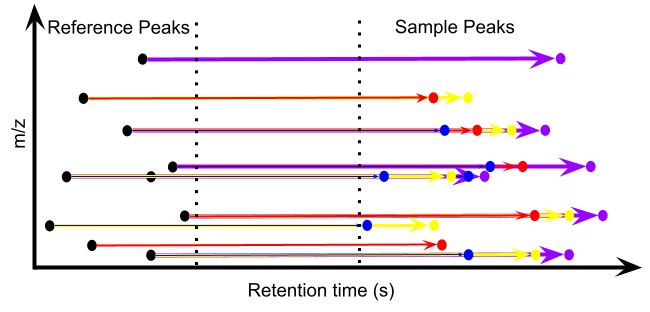

在进行非目的代谢组学或环境非目的分析时，通量是一个涉及数据质量的关键因素。通常我们会用同样的色谱质谱方法来跑样品序列，而序列会顺序执行样品分析任务，也就是当一个样品完全跑完后再进下一个样品，每个样品会生成一个数据文件。在这个过程中，即使我们把色谱分离时间压缩到15分钟，一天撑死也就跑不到一百个样品，而考虑上进样过程中的质控样品，实际能分析的样品数还要少。而如果要处理上千个样品，分析时间拖上个把月没问题，一年一台连轴转不保养的仪器也就能处理不到一万个实际样品，更不用说每个样品可能要在不同色谱柱及正负离子下跑。在这个技术限制下，非目的代谢组学或环境非目的分析很难与其他组学的一天几千上万样品通量匹配，更不用说伴随样品数上升，批次效应或仪器稳定性需要额外进行矫正，数据质量控制会变得非常复杂，算得上卡脖子问题了。

这里面最大的限制其实就是序列进样，每增加一个样品就要增加一个完整的色谱分离时间。从数据角度看，就是每个样本会对应独立的数据，然而这样其实浪费了数据存储空间。打个比方，你去看A样品在10分钟流出的质谱图时，这个质谱图里只会包含A样品里物质，全扫描的大部分空间都是噪音。那我们就可以考虑保持样品数据空间不变通过增加样本来提高信息量，说人话就是我们不要等一个样品完全跑完才进下一个样品，而是按固定的时间间隔例如1分钟连续进不同的样品，这样在该数据10分钟收集到数据就会包含来自样品 A 10分钟分离的物质，样品 B 9分钟分离的物质，样品 C 8分钟分离的物质……以此类推。下图是一个示例，红虚线左边就是常规进样，此时荷质比-保留时间的数据存储空间是稀疏的，利用率不高，但如果按右边固定间隔进样，我们会看到数据存储空间利用率就提高了。

如果色谱柱分离效果在线，那么理论上在不同保留时间流出的同分异构体的时间间隔只有正好精确到1分钟才会出现对其他样品的干扰，而此时我们每增加一个样品，理论上需要增加的边际时间也只有1分钟，这样我们就可以实现一天分析上千个样品了。同时，背景或基质的干扰时间也自然而然被缩短，流动相消耗会大幅降低，等度洗脱下基本也不需要进行复杂的峰对齐步骤，可以说天下武功，唯快不破。

这想法并不是无源之水。事实上，上世纪70年代就出现了流动注射技术来提高通量，后面伴随色谱技术发展，也出现了固定时间间隔进样等度洗脱的方法，只是这些方法并不是用来处理未知物的，而是处理已知物的，例如高通量药物检测之类。如果你已经知道某个物质的保留时间，只要按进样的时间间隔增加保留时间就可以找到下一个样品出峰位置。但如果你不知道要测什么呢？这就回到了前面所说的场景，我可以这样进样，但数据咋处理？

我在今年的美国质谱年会提交了一个摘要，主要就是解决这个问题的，最近也提交了一份[预印本](https://chemrxiv.org/engage/chemrxiv/article-details/6897568d728bf9025ec3ab62)论文来公开这项技术。解决的思路也很简单，我们确实不知道要测什么，但其实也没必要知道要测什么，这里面最关键的信息就是在特定保留时间会出现特定荷质比，而这个信息我们可以通过在进行固定间隔进样前跑一下混合样的完全分离来获得。然后，我们只需要把混合样里所有会出现的保留时间与荷质比的组合拿到，那么后面不同样品里该物质的信息就可以通过寻找保留时间加上固定时间间隔与样品进样序号的乘积这个出峰时间该荷质比的响应来获得。这就好比钓鱼，我们并不知道鱼会出现在哪里，但是如果我们事先打过窝，那么只要在打窝的位置附近下钩就能找到对应的鱼，所以这个策略可以理解为先打窝后钓鱼的渔式进样。注意，这个方法并不需要每个样品都能找到该物质的峰，只是提供了找峰的空间范围，找不到就代表对应样本不含有该物质。下图是算法的一个演示。

只有想法没有行动那想法就是廉价的，这个想法我2017年就记在笔记里了，但当时并不具备将其转化为行动的能力与资源。现在的工作可以自由探索，我就又重新把这个想法捡了起来，通过跟实验室合作实际验证了一下。实操过程中最关键的地方要切断色谱进样与质谱收集之间的通讯，让其单独按设计好的进样序列进样而不去中断掉质谱数据采集。这里面自然没少踩坑，这些坑有些我放到预印本里了，有些虽然浅浅写了一笔，但背后的工作量并不少。

第一个坑就是固定的时间间隔需要根据数据重新算，原因在于如果你单独进样，进样过程的时间是不进行数据采集的，但在渔式进样里，质谱是需要连续采集信号的。因此，即使你设定隔一分钟进一次样，考虑上洗针等过程，每一针是固定时间间隔会多出大概半分钟，这样我们就需要写一个启发式算法来找到这个操作者可能不知道的时间间隔。当然，我希望这个坑可以通过改进仪器控制软件来实现而不是后期用软件方法补充。

第二个坑就是混合样品需要重复进样，理论上混合样品进一针，空白样品进一针就可以得到全部样品里可能出现的峰，但现实中发现样品里出现了大量存在固定时间间隔，但单一混合样品里没出现的峰。这个现象在DDA里也很明显，我只是没想到全扫描也需要一些重复进样，当然文章里用的是最保守的方法，只考虑了出现在所有六个混合样里的峰，但实际样品可以考虑放宽限制，除非你对自己质谱灵敏度特别有信心。

第三个坑最耗费时间，那就是峰提取软件会漏峰，明明在EIC里特别明显的峰，xcms就只能找到其中的一部分，这导致我第一次跑样后拿到的结果非常差，本来以为是算法问题，后来才发现峰表本身就不全。同时，你可以想象到渔式进样只会产生一个数据文件，文件也非常大，信息密度很高，有些软件根本就处理不了直接无响应。因此我只好自己写了个非常简单的依赖信噪比局部最大值找峰的算法，用C++写运行速度并不慢，但起码不会出现特别明显的漏峰。之所以用了很简单的算法，主要是渔式进样也是等度洗脱，峰形稳定，另外就是柱子不需要再平衡，流动相全程不变，当然这会牺牲柱效，但我们也测试了用不同等度条件进行洗脱，确实可以一定程度提高峰覆盖率，但既然这个方法看重的是高通量，那完全可以抓大放小，先优化出最好的等度条件，然后就用这个条件跑就可以了。这个地方其实希望色谱柱厂商也能跟进研发专用的等度洗脱柱，现在的色谱柱为了适应梯度洗脱做了一些性能取舍，等度洗脱其实还有很大优化空间。

我们实际测试了渔式进样在两根色谱柱上正负离子的表现，每个模式进样158个，其中每十个样品会加入一个混合样进行序列中质控，进样时间控制在六小时以内，而换常规进样则需要几天多批次设计。反复测试下发现保留时间偏移在10s以内，反相柱表现其实更好些，HILIC柱的偏移也在可接受范围呢。定量表现上，考虑10分钟的等度洗脱窗口，虽然在打窝过程我们其实找到了1000-3000的峰，考虑上序列中混合样峰响应偏差小于30%并且扣除掉空白样品里的峰，大概依然可以得到450-738个稳定峰，同样是反相柱表现优于HILIC柱，这个结果其实已经跟梯度进样考虑同等级质量控制后的峰数在同一量级了。另外，前面提到了同分异构体干扰问题，确实存在，但单就血样代谢组学而言，被影响的峰低于2%，如果你做脂肪类物质，一定先去评估下这个影响，优化出一个影响最小的固定间隔时间。如果看重分析通量且测试过自己关心的化合物可以被色谱柱分离，那么渔式进样会有天然的速度与成本优势，单一样品进样成本可以控制在10美元以内，比当前进样方式成本低至少一个数量级，这可以让高通量质谱筛查成为现实。同时，这个方法最关键的数据处理我已经写好了开源软件包，如果想试用这个方法也不需要对现有仪器进行物理改造，只要分开控制色谱进样与数据采集即可。其实色谱流动相是可以换成梯度洗脱的，只是此时间隔进样时间就不固定了，需要按柱子优化，或者间隔时间固定，但算法上需要识别流出模式，这些部分就留给后人改进吧。我并不在乎这预印本最后在哪里发表，现在也过了需要发表来证明自己的阶段，这本就是个兴趣使然的项目，只是想看到更多地方能实际用上这个方法。

欢迎试用！
