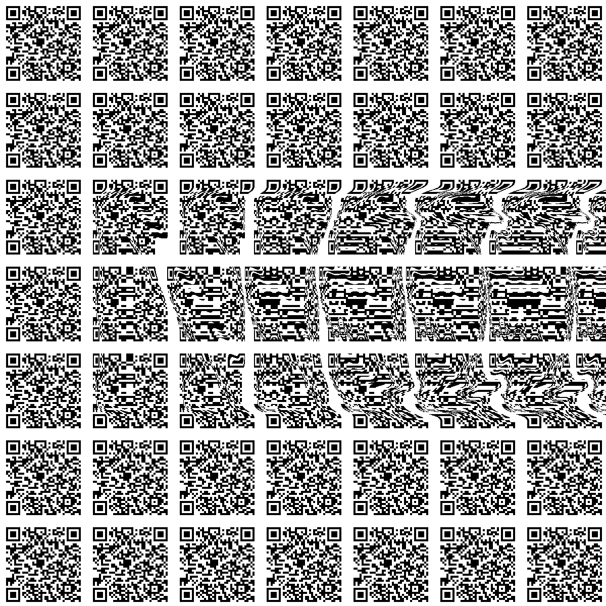

六年前的四月，于纽约市而言是安静的一个月，疫情冲击下所有人都开始在自己的日常里塞入社交距离、口罩、居家工作等概念。彼时我就在纽约，突如其来的改变我也有点懵，就整理了之前烂尾的项目，其中一个就是生成3D立体图的R包。现在翻看代码，那应该是我第一次去折腾C++，没有人工智能的时代我凑出了一套翻译自python的代码，写了篇[总结](https://yufree.cn/cn/2020/04/15/magic-eye/)，算是对自己有个交代。

今时不同往日，现在的我甚至都没有之前翻译python代码的勇气了，但我有人工智能。这两天我让人工智能对这个“史前”项目进行重组，上来就把我原始代码给骂了个狗血淋头。这不意外，我甚至没有任何反对意见，毕竟我现在都想不起来生成3D立体图的数学原理了。修完了代码后，我加入了中文支持，另外我还加入了很久前就想实现的功能，那就是数字隐写术。

数字隐写术是在图片上进行像素级操作。例如某个图片某个点像素灰度是173，那么我在上面加1从图上你看不出区别，但1跟0之间就构成了二进制，就可以写入信息。读取时在像素最低有效位的前固定位数上定义好密文长度，然后解密时自动往后找对应的位数进行解密。当然这些理论上全都可以自定义，解出来的东西可能还是被另一种方法加密过的乱码。

到了这一步自然就要做一个排列组合。3D立体图通过训练是能看出来的，但在这张图上进行数字隐写术后就会呈现双重加密，一层物理加密，一层数字加密。3D立体图本身是可以伪装成二维码的，而二维码也可以用作3D立体图的基本单元，这些方式排列组合后生成的图片二维码可以扫，也可以看3D立体图，然后还隐藏了数字密文。这种古典现代的混合加密方式属于那种只要加密的人不说，解密的人都不知道自己解对了没有，可以用来设计个人专有加密方式。当然，我也把之前的一种基于回归残差分析来隐藏信息的方法也移植进去了。从数字隐写术解密出来的数字串可以被读成一个多元回归数据集，然后多元回归做完了对残差作图就可以看到另外的信息。

前面那些都是我对人工智能说的，他确实也实现了，这样这个项目在我这才算放下了。当前的形态已经超出我的理解范围了，如果有人用这个包给我发个图，我大概率也不知道他究竟进行了几重加密，我在想会不会人类基因组里也有这种被写入非编码区密文？或者说我们可以合成出这样的分子，看到的与数码解析出来的都是不同的信息且都有意义，那个时候这种分子就可以是艺术品了。我认为好的加密解密方法一定要是一体多面，一份明文可以出多种有意义且可以矛盾的密文，在加密与解密的对抗中，算法设计者也没有最高权限，大家都在局中，一切都是命运石的安排。

当然，六年过去了，我现在也不纠结是否要用R来实现了。在项目网站里我让人工智能用js写了个网页，直接可以[在线](https://yufree.github.io/magiceyer/app.html)生成，做最基本的二重加密。这个网页一眼看上去就像人工智能做的，不知道为啥那么喜欢紫色，但我也不调了。其实有心人可以拿这个来做表情包啥的，以我对同类的了解，工具有了一定有人会拿这玩意搞事情，所以我先做个免责声明，跟我没关系，人工智能的锅，我写不出来。我搞这个纯属娱乐，3D立体图是我童年记忆的一部分，我也是直到奔三的年龄才第一次看出里面的信息，后面那些功能都属于玩具性质的，更新这个包更多是担心2020年GitHub的北极计划如果存了这个项目，那么后来人/机/人机看到更新会说，起码不是干垃圾。

只要你还有好奇心，可能的未来就是无限的，对吗？

